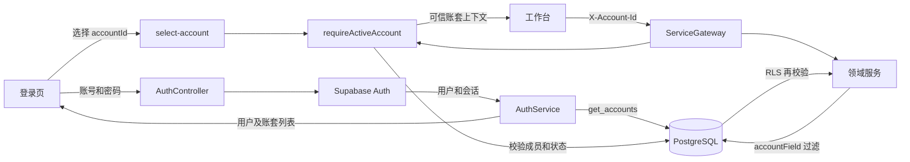
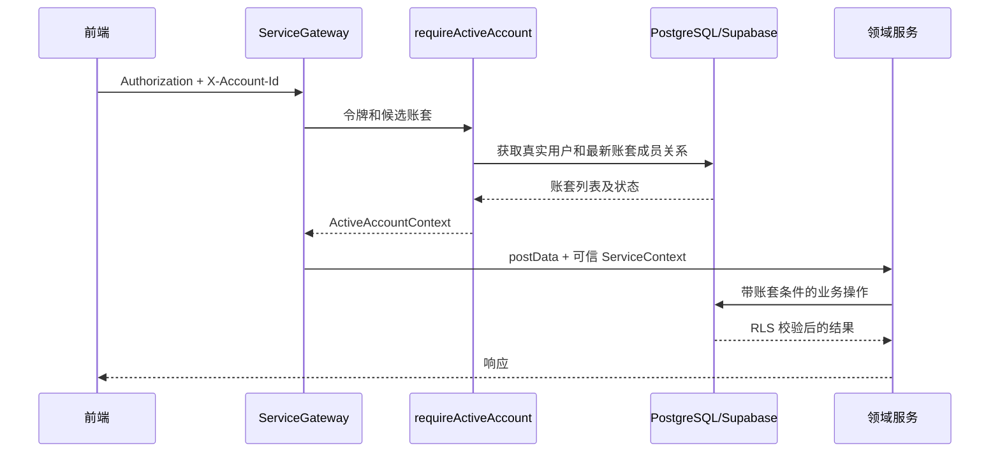

# 多账套登录功能实现说明

## 1. 功能概述

本功能采用用友、金蝶等 ERP 常见的“登录账号 + 业务账套”模型：

1. 用户先输入账号和密码，完成身份认证。
2. 系统返回该用户有权访问的账套列表。
3. 用户选择本次工作的账套。
4. 服务端重新验证账套成员关系和账套状态。
5. 账套启用成功后，后续所有业务请求都在该账套上下文中执行。

这里的“启用账套”是为当前会话选择业务上下文，并不是把一个停用账套修改为启用状态。

账套不是普通查询条件。浏览器保存的账套 ID 只用于表达用户选择，真正的授权判断始终由服务端完成。

## 2. 总体架构



整个实现分为五层：

- **认证层**：验证身份，获取用户会话。
- **账套选择层**：验证账套成员关系和状态，记录默认及最近账套。
- **网关上下文层**：把浏览器传来的账套 ID 转换成可信的 `ServiceContext`。
- **业务隔离层**：通用 CRUD 和各领域服务强制追加账套条件。
- **数据库防线**：通过外键、安全函数和 RLS 防止越权访问。

## 3. 数据库模型

数据库迁移文件为：

`supabase/migrations/20260804090000_account_set_login.sql`

### 3.1 账套主数据

账套继续复用 `basejump.accounts`，新增或规范化以下字段：

| 字段 | 类型 | 说明 |
| --- | --- | --- |
| `id` | `uuid` | 账套主键，即系统中的 `account_id` |
| `code` | `text` | ERP 账套编码，全局唯一 |
| `name` | `text` | 账套名称 |
| `status` | `text` | `active`、`inactive` 或 `archived` |
| `base_currency` | `text` | 本位币，默认 `CNY` |
| `timezone` | `text` | 账套时区，默认 `Asia/Shanghai` |
| `fiscal_year_start_month` | `smallint` | 会计年度起始月份 |

只有 `status = 'active'` 的账套可以进入。

迁移同时建立默认制造账套：

```text
ID:   00000000-0000-4000-8000-000000000001
编码: 001
名称: 默认制造账套
```

### 3.2 账套成员

成员关系复用 `basejump.account_user`：

| 字段 | 说明 |
| --- | --- |
| `account_id` | 用户所属账套 |
| `user_id` | Supabase Auth 用户 ID |
| `account_role` | `owner` 或 `member` |

一个用户可以属于多个账套，同一个账套也可以包含多个用户。

### 3.3 用户账套偏好

`public.account_user_preferences` 保存用户的账套使用偏好：

| 字段 | 说明 |
| --- | --- |
| `user_id` | 用户 ID，主键 |
| `default_account_id` | 用户明确设置的默认账套 |
| `last_account_id` | 最近进入的账套 |
| `last_login_at` | 最近一次进入账套的时间 |
| `updated_at` | 更新时间 |

默认账套和最近账套是两个不同概念：

- 工作台临时切换账套只更新 `last_account_id`。
- 登录页勾选“下次优先使用该账套”时才更新 `default_account_id`。
- 登录页优先选择有效的默认账套，不用本地最近记录覆盖用户的明确设置。

### 3.4 登录审计

`public.account_login_events` 记录每次成功进入账套的事件，包括：

- 用户 ID；
- 账套 ID；
- 进入时间；
- 可扩展的审计元数据。

### 3.5 账套级角色

`public.admin_user_roles` 新增 `account_id`：

- `account_id` 为具体 UUID：该角色只在对应账套生效。
- `account_id is null`：显式的平台级角色。

升级前的历史角色通过 `public.app_migration_markers` 只迁移一次，归入默认制造账套。迁移标记完成后，再次执行 SQL 不会误改后来创建的平台级角色。

### 3.6 历史 tenant_id

历史模块中部分表使用 `tenant_id text`，这些表统一保存：

```text
tenant_id = account_id::text
```

新业务表优先使用 `account_id uuid`，避免继续扩大字符串租户字段的使用范围。

## 4. 两阶段登录实现

### 4.1 第一阶段：身份认证

接口：

```http
POST /api/auth/signin
Content-Type: application/json

{
  "email": "admin",
  "password": "123456"
}
```

处理过程：

1. `AuthService.signInWithPassword` 调用 Supabase Auth。
2. 认证成功后调用 `get_accounts()` 获取当前用户的全部账套。
3. 返回用户、会话、账套列表和基础权限。
4. 此时 `activeAccount` 为 `null`，`accountRequired` 为 `true`。
5. 用户不能因为密码验证成功就直接进入工作台。

返回结构的关键部分如下：

```json
{
  "user": { "id": "..." },
  "session": { "access_token": "..." },
  "accounts": [
    {
      "account_id": "...",
      "code": "001",
      "name": "默认制造账套",
      "status": "active",
      "account_role": "owner",
      "is_default": true,
      "is_last_used": false
    }
  ],
  "activeAccount": null,
  "accountRequired": true
}
```

前端登录页位于 `frontend/pages/signin.vue`。界面维护两个步骤：

- `credentials`：输入登录账号和密码；
- `account`：搜索并选择账套。

停用或归档账套仍可显示，但对应选项不可点击，方便用户了解自己为什么无法进入。

### 4.2 第二阶段：选择账套

接口：

```http
POST /api/auth/select-account
Authorization: Bearer <access-token>
Content-Type: application/json

{
  "accountId": "00000000-0000-4000-8000-000000000001",
  "setDefault": true
}
```

`AuthService.selectAccount` 不直接相信请求体中的 `accountId`，而是调用 `requireActiveAccount`：

1. 校验 `accountId` 是否为 UUID。
2. 根据访问令牌获取真实用户。
3. 实时调用 `get_accounts()`，不使用陈旧的成员列表。
4. 确认用户仍然属于目标账套。
5. 确认目标账套状态仍为 `active`。
6. 调用 `select_account_set_with_preference(account_id, set_default)`。
7. 更新最近账套，按需更新默认账套，并写入登录审计。
8. 清理该用户的权限缓存，重新加载目标账套的权限。
9. 返回 `activeAccount` 和账套级权限。

选择成功后：

```json
{
  "activeAccount": {
    "account_id": "00000000-0000-4000-8000-000000000001",
    "code": "001",
    "name": "默认制造账套"
  },
  "accountRequired": false
}
```

### 4.3 会话恢复

页面刷新时，前端读取本地保存的 `enlearn_active_account_id`，并调用：

```http
GET /api/auth/me
Authorization: Bearer <access-token>
X-Account-Id: <account-id>
```

服务端重新校验该账套：

- 仍然有效：恢复 `activeAccount` 和账套权限。
- 成员关系被撤销：保留登录身份，但返回 `accountRequired: true`。
- 账套已停用或归档：保留登录身份，但要求重新选择账套。

因此，旧的本地账套 ID 不会成为授权凭据，也不会导致用户身份被无条件清空。

## 5. 请求账套上下文

### 5.1 前端自动添加请求头

`frontend/src/spa-compat.ts` 对后端请求统一处理：

```http
X-Account-Id: <当前账套 UUID>
```

`/auth/select-account` 是例外，因为选择账套时尚未建立当前账套，请求使用 body 中的候选 `accountId`，服务端再做验证。

### 5.2 网关实时校验

所有 `/api/service` 请求都会先进入 `ServiceGatewayController`：



校验通过后，网关构造可信的 `ServiceContext`：

```ts
{
  authorization,
  requestId,
  userId,
  accountId,
  accountCode,
  accountName,
  accountRole
}
```

领域服务只能使用该上下文中的 `userId` 和 `accountId`，不能把请求体中的同名字段当成可信身份。

### 5.3 微服务错误状态透传

领域服务通过 Redis 微服务总线返回错误时，会同时返回 `message` 和 `statusCode`。网关保留 4xx 状态，例如跨账套访问返回 `403`，不会统一包装为 `502 Bad Gateway`。

## 6. 通用 CRUD 数据隔离

`api/src/common/base.service.ts` 在 `ResourceConfig` 中增加：

```ts
accountField?: string;
```

业务资源只需要声明账套字段：

```ts
sales_orders: {
  tableName: 'sales_orders',
  accountField: 'account_id'
}

chat_messages: {
  tableName: 'chat_messages',
  accountField: 'tenant_id'
}
```

`BaseService` 会在以下操作中自动应用当前账套：

- 列表查询：追加 `accountField = context.accountId`；
- 新增：覆盖客户端提交的账套字段；
- 修改：在主键或过滤条件之外追加账套条件；
- 删除：追加账套条件；
- 主表和明细保存：主明细必须同时配置账套范围；
- 明细替换：删除旧明细时追加账套条件；
- `afterSave`：后续更新同样限定当前账套；
- 权限检查：读取当前账套的角色和权限。

即使客户端提交：

```json
{
  "account_id": "另一个账套的 UUID"
}
```

服务端也会拒绝或覆盖该值，不能借此完成跨账套读写。

对于仍然通过 `tableName` 执行的兼容查询，`accountFieldForTable` 会识别销售、通知、Chat、Workflow 和打印日志等已知账套表，并自动附加账套条件。

## 7. 各业务模块的特殊处理

### 7.1 账户与角色

- 账户服务要求请求中的目标 `accountId` 与当前账套一致。
- `admin_user_roles` 配置 `accountField: 'account_id'`。
- 分配角色的用户必须是当前账套成员。
- 账套 A 的管理员不能给账套 B 分配角色。

### 7.2 Workflow

网关将可信上下文转换为 Workflow RPC 请求头：

```http
x-tenant-id: <context.accountId>
x-user-id: <context.userId>
```

实现中的关键约束：

- 忽略列表 query 和普通请求体中的 `tenantId`。
- 普通业务请求不能通过 body 中的 `userId` 冒充其他操作人。
- 模型、定义、实例、任务和时间线按 `tenant_id` 查询。
- 固定审批人必须属于当前账套。
- 转办、加签、候选人、抄送人和通知收件人必须属于当前账套。
- 开发环境的一键审批测试身份需要流程设计权限，生产环境禁用。

### 7.3 Chat

Chat 同时保护 HTTP 和 WebSocket 两条链路：

- WebSocket 握手必须携带访问令牌和 `accountId`。
- 握手阶段调用 `requireActiveAccount`。
- 创建单聊或群聊时，所有参与人必须属于当前账套。
- 发送消息前验证会话的 `tenant_id` 和当前账套一致。
- 用户必须是该会话的有效成员。
- 编辑或删除消息还要求当前用户是消息发送人。

### 7.4 通知

- 消息、偏好、投递和事件都配置 `tenant_id`。
- 指定收件人时调用 `assertAccountUsers`。
- 全员通知只读取当前账套成员，不再读取平台全部用户。
- 未读数、已读和归档操作同时匹配当前账套及接收人。

### 7.5 销售和打印

- `sales_orders` 与 `sales_order_lines` 使用 `account_id uuid`。
- 销售主表和明细必须使用相同账套。
- 打印日志使用 `tenant_id`，查看日志需要当前账套的 `print.logs.view` 权限。

## 8. 数据库 RLS 防线

服务层隔离之外，迁移还为以下数据建立 RLS：

- 账套偏好与登录审计；
- 账套级角色；
- 销售订单和销售明细；
- Workflow 定义、实例、任务、历史和作业；
- 通知事件、消息、投递和偏好；
- Chat 会话、成员、消息、已读和表情；
- 打印日志。

主要安全函数包括：

| 函数 | 作用 |
| --- | --- |
| `is_active_account_member(uuid)` | 判断当前认证用户是否是启用账套成员 |
| `account_user_ids(uuid)` | 安全获取某账套的成员 ID |
| `is_account_user(uuid, uuid)` | 判断指定用户是否属于指定账套 |
| `current_user_permission_codes(uuid)` | 获取当前用户在指定账套的权限 |
| `has_account_permission(uuid, text)` | 判断当前用户是否拥有账套权限 |
| `select_account_set_with_preference(uuid, boolean)` | 进入账套并更新偏好及审计 |

RLS 是纵深防御，不代替网关和服务层校验。特别是使用 service role 的代码仍必须显式附加账套条件。

## 9. 前端状态与账套切换

### 9.1 认证状态

`frontend/composables/useAuthState.ts` 增加：

```ts
accounts
activeAccount
accountRequired
accountEpoch
```

`frontend/composables/useAuth.ts` 负责：

- 保存和恢复 `enlearn_active_account_id`；
- 应用登录和选账套响应；
- 调用 `select-account`；
- 账套变化时递增 `accountEpoch`；
- 派发 `enlearn:account-changed` 事件；
- 退出登录时清理账套状态。

### 9.2 路由保护

工作台路由要求同时满足：

```ts
auth.user.value && auth.activeAccount.value
```

只有身份、没有账套时，用户会被送回登录页第二阶段，而不是进入业务页面。

### 9.3 工作台切换

`frontend/layouts/dashboard.vue` 的顶栏显示：

```text
账套编码 + 账套名称
```

切换账套后执行：

1. 调用 `auth.selectAccount(accountId)` 再次经过服务端校验。
2. 清空旧菜单和已访问页签。
3. 返回工作台首页。
4. 重新加载账套级菜单和权限。
5. 关闭并重建 Chat Socket。
6. 清空通知列表及未读数。
7. 递增 `accountEpoch`，重建布局与 KeepAlive 缓存。
8. Workflow 草稿使用包含 `accountId` 的本地存储键。

这样可以避免切换后仍显示旧账套页面、通知或聊天数据。

## 10. 安全设计要点

### 10.1 不信任浏览器账套 ID

`localStorage` 和 `X-Account-Id` 都可以被用户修改，因此只把它们视为“候选账套”。服务端每次业务请求都会重新检查成员关系和账套状态。

### 10.2 不信任请求体身份

Workflow、通知、Chat 等模块使用认证令牌解析出的真实用户，不使用客户端提交的 `userId` 作为普通业务操作人。

### 10.3 ID 查询也必须带账套

仅按主键查询并不安全。即使 UUID 很难猜，也必须同时匹配：

```sql
where id = :id
  and account_id = :current_account_id
```

使用 `tenant_id` 的历史表采用相同规则。

### 10.4 权限按账套重新加载

选账套或切换账套后清理用户权限缓存，并以目标账套重新查询角色和权限，防止旧账套权限继续生效。

## 11. 新业务接入多账套的规范

新增业务模块时按以下步骤接入。

### 11.1 数据库

优先增加：

```sql
account_id uuid not null references basejump.accounts(id)
```

并建立常用组合索引，例如：

```sql
create index idx_example_account_created
  on public.example_business(account_id, created_at desc);
```

历史兼容模块如必须使用 `tenant_id text`，其值必须是 `account_id::text`。

### 11.2 服务配置

在资源中声明：

```ts
example_business: {
  tableName: 'example_business',
  accountField: 'account_id'
}
```

不要从 `postData.accountId` 读取当前账套，应使用：

```ts
context.accountId
```

### 11.3 关联用户

业务中出现审批人、负责人、参与人、收件人等用户字段时，保存前调用：

```ts
await assertAccountUsers(context, userIds);
```

### 11.4 特殊查询

自定义 SQL、RPC、批量更新、后台任务和 service role 操作必须手动追加账套条件。通用 `BaseService` 不能自动保护绕过它执行的 SQL。

### 11.5 RLS

至少增加以下约束之一：

```sql
using (public.is_active_account_member(account_id))
```

或需要权限时：

```sql
using (public.has_account_permission(account_id, 'example.manage'))
```

### 11.6 测试

每个新模块至少验证：

- 正常读取当前账套数据；
- 请求体伪造其他 `account_id`；
- 使用当前账套请求其他账套的记录 ID；
- 非成员账套请求；
- 成员撤销后立即拒绝；
- 账套停用后立即拒绝；
- 使用 service role 时仍不会遗漏账套条件。

## 12. 迁移、验证与运行

### 12.1 应用迁移

```bash
pnpm --dir api db:apply-account-sets
```

脚本特点：

- 自动读取项目 `.env`；
- 优先使用 `DIRECT_URL`，也兼容 `DATABASE_URL`；
- 自动移除 PostgreSQL 客户端不识别的 `pgbouncer` 参数；
- 在单个数据库事务中执行；
- 失败时回滚；
- SQL 可重复执行。

当前远端数据库没有 `supabase_migrations.schema_migrations`，所以项目沿用脚本直接执行迁移的方式。

### 12.2 安全回归

```bash
pnpm --dir api security:verify-account-sets
```

脚本覆盖：

- 伪造非成员 `X-Account-Id`；
- 缺少账套请求头；
- 跨账套 Chat 会话；
- Workflow 请求体冒充操作人；
- 跨账套转办与加签；
- 跨账套通知收件人；
- 跨账套角色分配；
- 撤销成员后立即拒绝；
- 停用账套后立即拒绝；
- 测试结束后恢复成员关系、账套状态并清理测试会话。

### 12.3 常规验证

```bash
pnpm --dir api typecheck
pnpm --dir api test
pnpm --dir api build
pnpm build
```

## 13. 关键文件索引

| 文件 | 作用 |
| --- | --- |
| `frontend/pages/signin.vue` | 两阶段登录界面 |
| `frontend/composables/useAuth.ts` | 登录、恢复、选择和切换账套 |
| `frontend/composables/useAuthState.ts` | 前端认证及账套状态 |
| `frontend/src/spa-compat.ts` | 自动添加 `X-Account-Id` |
| `frontend/layouts/dashboard.vue` | 工作台账套切换器 |
| `api/src/auth/auth.controller.ts` | 认证及选账套接口 |
| `api/src/auth/auth.service.ts` | 两阶段登录服务逻辑 |
| `api/src/common/utils/account-context.ts` | 账套 ID、成员和状态校验 |
| `api/src/gateway/service-gateway.controller.ts` | 业务请求账套网关 |
| `api/src/common/base.service.ts` | 通用 CRUD 账套隔离 |
| `api/src/common/utils/supabase.ts` | 账套列表及账套权限加载 |
| `api/src/workflow/workflow.service.ts` | Workflow 可信租户和操作人注入 |
| `api/src/chat-service/chat.service.ts` | Chat 账套与参与人校验 |
| `api/src/notification-service/notification.service.ts` | 通知账套与收件人校验 |
| `supabase/migrations/20260804090000_account_set_login.sql` | 数据结构、安全函数和 RLS |
| `api/scripts/apply-account-set-migration.ts` | 迁移执行脚本 |
| `api/scripts/verify-account-set-security.ts` | 多账套安全回归脚本 |

## 14. 实现结果

该实现最终形成了三道互相独立的安全边界：

1. **网关校验**：每次业务请求验证用户、成员关系和账套状态。
2. **服务隔离**：所有业务读写使用可信 `ServiceContext` 并追加账套条件。
3. **数据库 RLS**：即使服务层出现遗漏，数据库仍按成员及账套权限限制访问。

前端负责提供清晰的账套选择和切换体验，但不承担最终授权。这样既保留了 ERP 多账套操作习惯，也能在成员撤销、账套停用或请求被篡改时立即阻止越权访问。
