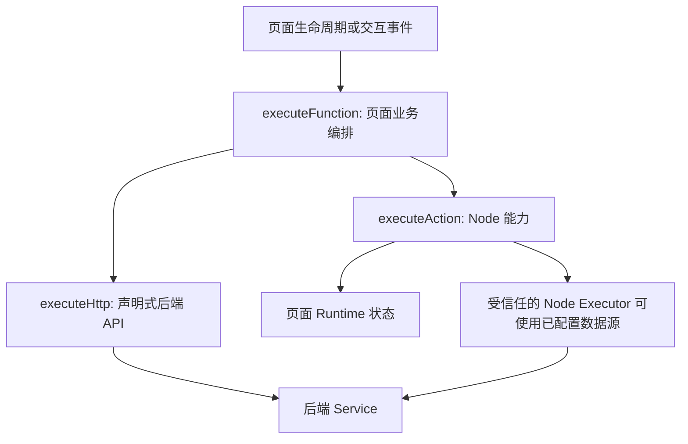
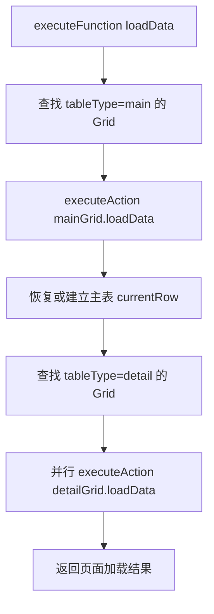

# 低代码脚本三入口架构

> 状态：目标架构约定  
> 更新日期：2026-08-28
> 核心决策：低代码脚本中的 `this` 只提供只读 `context`，以及三个可执行入口：`executeFunction`、`executeAction`、`executeHttp`。

## 1. 架构目标

低代码脚本不直接操作路由、消息、表单状态、表格状态、数据源或浏览器 API。所有副作用必须经过以下三个入口：

```ts
this.executeFunction(options)
this.executeAction(options)
this.executeHttp(options)
```

脚本可以读取：

```ts
this.context
```

但不能修改 `context`。最终脚本上下文应只有：

```ts
type LowCodeScriptThis = Readonly<{
  context: DeepReadonly<LowCodeScriptContext>;

  executeFunction<T = unknown>(
    options: ExecuteFunctionOptions,
  ): Promise<T>;

  executeAction<T = unknown>(
    options: ExecuteActionOptions,
  ): Promise<T>;

  executeHttp<T = unknown>(
    options: ExecuteHttpOptions,
  ): Promise<T>;
}>;
```

不再向脚本公开：

```text
$api       $form      $grid      $search
$source    $page      $router    $message
$dialog    $events    fetch      window
document   localStorage          动态 import
```

## 2. 三层职责



三者分别回答不同问题：

| 入口 | 回答的问题 | 作用域 |
| --- | --- | --- |
| `executeFunction` | 页面要完成什么 | 页面级业务编排 |
| `executeAction` | 哪个 Node 做什么 | 单个页面节点 |
| `executeHttp` | 调用哪个声明过的接口 | 后端服务调用 |

基本调用方向为：

```text
executeFunction
  -> executeAction
  -> executeHttp
```

页面函数可以组合多个节点动作和 HTTP 请求。节点动作不能反向决定页面业务流程，HTTP 调用也不能直接操作 Node。

## 3. `this.context`

`context` 是脚本启动时生成的只读 JSON 快照：

```ts
type LowCodeScriptContext = {
  page: {
    id: string;
    code: string;
    route: string;
    title: string;
    pageType: 'list' | 'edit' | 'detail' | 'custom';
    version: number;
  };
  route: {
    query: Record<string, unknown>;
    params: Record<string, unknown>;
    path: string;
    fullPath: string;
  };
  data: Record<string, unknown>;
  forms: Record<string, Record<string, unknown>>;
  searches: Record<string, Record<string, unknown>>;
  grids: Record<string, GridRuntimeSnapshot>;
  event: Record<string, unknown>;
};
```

读取示例：

```js
async function main() {
  const row = this.context.grids["order-main-grid"]?.currentRow;
  const routeId = this.context.route.query.id;
  const form = this.context.forms["order-form"];

  return { row, routeId, form };
}
```

下面的写法无效，也不应被支持：

```js
this.context.forms["order-form"].status = "approved";
this.context.data.orders.push({ id: 1 });
```

原因：

- `context` 是深度冻结的快照。
- 修改快照不会成为 Runtime 状态变更。
- 所有状态变更必须进入三个可审计入口。

## 4. `executeFunction`

### 4.1 定位

`executeFunction` 执行页面函数，负责页面级业务编排。

```ts
type ExecuteFunctionOptions = {
  name: string;
  args?: Record<string, unknown>;
};
```

调用示例：

```js
async function main() {
  return this.executeFunction({
    name: "loadData",
    args: {
      reason: "search",
    },
  });
}
```

页面函数适合处理：

- 页面首次加载、查询、保存和刷新。
- 新增、编辑、复制、审核、反审、关闭和退出。
- 查找页面中的主表与明细表。
- 编排多个 `executeAction()`。
- 编排多个 `executeHttp()`。
- 控制调用顺序、条件分支和错误处理。

### 4.2 函数来源

页面函数有两个来源，按以下顺序解析：

1. 页面自定义函数：`page.schema.functions`
2. 系统内置函数：`runtime-core/page-function/index.ts`（公开路径由 `runtime/page-function/index.ts` 兼容转发）

内置函数可以直接组合框架提供的受信任 UI 能力，例如列表页的 `designForm` 在
`list-page-function.ts` 中打开表单设计器。脚本仍只调用 `executeFunction`；当前行校验、
保存后的刷新和消息提示仍由内置页面函数完成。

解析优先级：

```text
page.schema.functions
  -> 找不到时使用 page-function/index.ts 聚合的内置函数
  -> 都不存在则报错
```

页面自定义函数可以覆盖同名内置函数，但不能绕开脚本策略和三个入口限制。

### 4.3 页面三个核心函数

每个标准页面应具备以下三个基础函数：

| 函数 | 职责 |
| --- | --- |
| `loadData` | 获取页面数据，并分发给对应 Node |
| `saveData` | 收集、校验并保存页面数据 |
| `refreshData` | 保留必要交互状态后重新执行 `loadData` |

它们是页面函数，不是 `this` 上新增的方法。正确调用方式是：

```js
await this.executeFunction({ name: "loadData", args: {} });
await this.executeFunction({ name: "saveData", args: {} });
await this.executeFunction({ name: "refreshData", args: {} });
```

错误方式：

```js
await this.loadData();
await this.saveData();
await this.refreshData();
```

### 4.4 `loadData` 约定

列表页的默认 `loadData` 编排：



职责包括：

1. 展平页面 Node，查找 `kind="grid"` 且 `tableType="main"` 的主表。
2. 调用主表的 `loadData` Node Action。
3. 按主键恢复刷新前的当前行；无法恢复时按页面策略选择首行或保持空值。
4. 找出所有 `tableType="detail"` 的 Grid。
5. 明细表根据主表当前行生成关联过滤条件，再调用各自的 `loadData`。
6. 返回主表、明细表和错误信息的结构化结果。

推荐返回值：

```ts
type PageLoadResult = {
  mainGrid?: {
    nodeId: string;
    rows: Record<string, unknown>[];
    currentRow: Record<string, unknown> | null;
  };
  details: Record<string, Record<string, unknown>[]>;
  errors: Array<{
    nodeId?: string;
    sourceKey?: string;
    message: string;
  }>;
};
```

没有主 Grid 的页面不应静默选择任意 Grid。应采取以下显式策略之一：

- 页面函数通过 `args.mainGrid` 指定 Node ID。
- 页面只有一个 `tableType="normal"` Grid 时，由标准函数明确允许其作为主 Grid。
- 自定义页面覆盖 `loadData`。
- 配置错误时直接报告“未找到主 Grid”。

### 4.5 `saveData` 约定

`saveData` 负责：

1. 确定需要保存的 Form 和数据源。
2. 执行表单校验。
3. 判断新增、修改或复制状态。
4. 调用声明过的保存 API，或受信任的数据源保存执行器。
5. 更新基线、主键和页面模式。
6. 按参数决定是否调用 `refreshData` 或退出页面。

推荐参数：

```ts
type SaveDataArgs = {
  formIds?: string[];
  refresh?: boolean;
  exit?: boolean;
};
```

### 4.6 `refreshData` 约定

`refreshData` 只负责编排刷新，不重复实现加载：

```text
捕获查询条件和 Grid 交互状态
  -> executeFunction("loadData")
  -> 恢复可恢复的当前行和选择行
  -> 返回 loadData 结果
```

必须避免：

```text
refreshData -> loadPageData -> refreshData
```

`refreshData` 可以调用 `loadData`，但 `loadData` 不能反向调用 `refreshData`。

### 4.7 递归规则

- 页面函数可以调用另一个页面函数。
- 同一个函数不能出现在当前调用栈两次。
- 检测到直接或间接递归时立即终止并报告调用链。
- 应设置最大函数调用深度，建议默认不超过 16 层。

## 5. `executeAction`

### 5.1 定位

`executeAction` 调用具体 Node 注册的方法。

```ts
type ExecuteActionOptions = {
  node: string;
  method: string;
  [parameter: string]: unknown;
};
```

调用示例：

```js
async function main() {
  return this.executeAction({
    node: "order-main-grid",
    method: "loadData",
    filters: {
      status: "open",
    },
  });
}
```

`node` 必须是页面中真实存在的 Node ID，`method` 必须是 `lowcode_node_actions` 中该 Node 类型已启用且满足 `applicable_when` 的 Action。

### 5.2 当前 Node Action

| Node | Method | 作用 |
| --- | --- | --- |
| `grid` | `loadData` | 根据 Grid 数据源和过滤条件请求数据 |
| `grid` | `reloadData` | 使用本地数组覆盖 Grid 数据 |
| `grid` | `getChanges` | 返回 Grid 的新增、更新和删除集合 |
| `grid` | `validate` | 使用 Grid 的编辑规则校验当前全部行 |
| `grid` | `addRow` | 向 Grid 末尾新增一行并设为当前行 |
| `grid` | `deleteCurrentRow` | 删除 Grid 当前行；无当前行时返回 `null` |
| `form` | `loadData`、`setData`、`validate`、`getData`、`refreshOptions`、`resetData` | 编辑表单加载数据，或写入、校验、读取、刷新下拉和重置表单 |
| `searchForm` | `setData`、`validate`、`getData`、`refreshOptions`、`resetData` | 写入、校验、读取、刷新下拉或重置查询表单 |
| `modal` | `open` | 打开弹框并等待结果 |
| `drawer` | `open` | 打开抽屉并等待结果 |

Node Action 按 Node 类型全局维护在：

```text
lowcode_node_actions
```

API 将启用的 Action 附加到运行页面；`runtime-core/node-action-registry.ts` 只负责筛选和查询，`runtime/lowcode-page-script-runtime.ts` 在 QuickJS 中执行 `source_code`，并通过 `$node.call` 提供通用 Host Bridge。

### 5.3 边界

Node Action 可以：

- 读取目标 Node 配置。
- 读写该 Node 对应的 Runtime 状态。
- 使用该 Node 已绑定的数据源。
- 返回 JSON 可序列化结果。

Node Action 不应：

- 自行决定整个页面的业务流程。
- 隐式操作无关 Node。
- 接受任意服务名和方法名。
- 执行页面 Schema 中不存在的脚本。
- 将 `grid.editClick` 等事件名当成 Method。

Node Action 内部如果需要请求绑定的数据源，应由受信任的 Host Executor 完成。用户脚本仍然只看见 `executeAction()`，不会获得底层 Service API。

## 6. `executeHttp`

### 6.1 定位

`executeHttp` 调用页面提前声明的 API。

```ts
type ExecuteHttpOptions = {
  api: string;
  method?: string;
  body?: Record<string, unknown>;
};
```

调用示例：

```js
async function main() {
  const row = this.context.event.row;

  return this.executeHttp({
    api: "approveOrder",
    body: {
      id: row.id,
    },
  });
}
```

页面 Schema 必须提前声明 API：

```json
{
  "apis": {
    "approveOrder": {
      "serviceName": "planning",
      "serviceMethod": "approveOrder",
      "method": "POST",
      "postData": {
        "source": "lowcode"
      },
      "resultPath": "data"
    }
  }
}
```

### 6.2 约束

- `api` 必须存在于 `page.schema.apis`。
- 调用方法必须与声明的 `method` 一致，脚本不能临时改成其他方法。
- `body` 必须是 JSON 可序列化对象。
- Host 合并固定 `postData` 和脚本 `body`。
- 可通过 `resultPath` 只返回响应中的指定部分。
- 页面权限和后端接口权限都必须通过。
- 不允许脚本直接填写 URL、`serviceName` 或 `serviceMethod`。

错误方式：

```js
await fetch("/api/orders/approve");
await this.$api.invoke("planning.approveOrder", payload);
```

## 7. 标准执行流程

### 7.1 页面初始化

```text
Page Renderer 挂载
  -> executeFunction({ name: "loadData", args: { reason: "init" } })
  -> 页面函数查找主 Grid
  -> executeAction({ node: mainGridId, method: "loadData" })
  -> 建立主表当前行
  -> executeAction({ node: detailGridId, method: "loadData" })
  -> 页面进入 ready 状态
```

页面 Renderer 不再自行遍历所有数据源并决定如何请求。Renderer 只负责触发生命周期页面函数和维护状态。

### 7.2 查询

```text
SearchForm submit
  -> 写入查询条件
  -> executeFunction({ name: "loadData", args: { reason: "search" } })
  -> 重新加载主表
  -> 重新建立当前行
  -> 重新加载明细表
```

### 7.3 刷新

```text
刷新按钮
  -> executeFunction({ name: "refreshData" })
  -> 保存可恢复的交互状态
  -> executeFunction({ name: "loadData", args: { reason: "refresh" } })
  -> 恢复交互状态
```

### 7.4 保存

```text
保存按钮
  -> executeFunction({ name: "saveData" })
  -> 收集并校验 Form
  -> executeHttp({ api: "saveRecord", body })
  -> executeFunction({ name: "refreshData" }) 或退出
```

### 7.5 审核

```text
审核按钮
  -> executeFunction({ name: "approve", args })
  -> 从 context.grids 获取选中行
  -> executeHttp({ api: "approveRecord", body })
  -> executeFunction({ name: "refreshData" })
```

## 8. 副作用归属

所有旧的直接能力都应映射到三个入口：

| 旧能力或需求 | 目标入口 |
| --- | --- |
| 页面加载、刷新、保存 | `executeFunction` |
| 新增、编辑、审核、退出 | `executeFunction` |
| 路由跳转 | `executeFunction` 中的页面函数 |
| 显示消息 | `executeFunction` 中的页面函数 |
| 发布业务事件 | `executeFunction` 中的页面函数 |
| Form 写入数据 | `executeAction(form.setData)` |
| Form 校验、读取、刷新下拉、重置 | `executeAction(form.validate/getData/refreshOptions/resetData)` |
| Grid 请求数据 | `executeAction(grid.loadData)` |
| Grid 覆盖本地数据 | `executeAction(grid.reloadData)` |
| Grid 校验、新增行、删除当前行 | `executeAction(grid.validate/addRow/deleteCurrentRow)` |
| 打开 Modal 或 Drawer | `executeAction(overlay.open)` |
| 调用业务接口 | `executeHttp` |

如某项能力无法自然归入三类之一，应先重新确认它属于页面编排、Node 能力还是后端调用，再扩展对应 Registry。不能为方便而向 `this` 增加第四个执行函数。

## 9. 安全模型

### 9.1 最小能力面

脚本 Worker 只向 QuickJS 注入：

```text
context
executeFunction
executeAction
executeHttp
```

Host 只接受三类 Capability：

```text
pageFunction.execute
action.execute
http.execute
```

原有 `form.patch`、`grid.setRows`、`router.push`、`message.success` 等 Capability 不再作为脚本公共 API；这些行为由三类入口内部的受信任实现完成。

### 9.2 白名单

- Function 必须存在于页面函数或内置函数 Registry。
- Action 必须存在于 Node Action Registry，并与目标 Node 的 `kind` 匹配。
- HTTP API 必须存在于 `page.schema.apis`。
- 每个入口在执行前检查页面权限、动作权限和 API 权限。
- 后端接口必须独立执行最终鉴权。

### 9.3 隔离与限制

脚本继续运行在 QuickJS Worker 中，并保持：

- 默认执行超时。
- Worker 启动超时。
- 内存限制。
- 调用栈限制。
- API 调用次数限制。
- 参数和返回值载荷限制。
- JSON 可序列化约束。
- 禁止 `import`、`export`、DOM 和浏览器全局对象。

## 10. 错误与返回值规范

三个入口统一返回 `Promise<T>`，失败时抛出结构化错误：

```ts
type LowCodeExecutionError = {
  code: string;
  message: string;
  entry: 'function' | 'action' | 'http';
  target: string;
  details?: Record<string, unknown>;
};
```

建议错误代码：

| 错误代码 | 含义 |
| --- | --- |
| `FUNCTION_NOT_FOUND` | 页面函数不存在或未启用 |
| `FUNCTION_RECURSION` | 页面函数出现递归调用 |
| `NODE_NOT_FOUND` | Node ID 不存在 |
| `ACTION_NOT_SUPPORTED` | Node 类型不支持指定 Method |
| `ACTION_INVALID_ARGUMENT` | Node Action 参数无效 |
| `API_NOT_DECLARED` | API 未在页面 Schema 中声明 |
| `API_METHOD_MISMATCH` | 调用方法与声明不一致 |
| `PERMISSION_DENIED` | 权限检查失败 |
| `EXECUTION_TIMEOUT` | 脚本或能力调用超时 |
| `PAYLOAD_TOO_LARGE` | 参数或返回值超过限制 |

脚本可在页面函数内处理可恢复错误：

```js
async function main() {
  try {
    return await this.executeHttp({
      api: "saveOrder",
      body: this.context.forms["order-form"],
    });
  } catch (error) {
    return this.executeFunction({
      name: "notify",
      args: {
        type: "error",
        message: error.message,
      },
    });
  }
}
```

## 11. Schema 约定

### 11.1 页面函数

页面 Schema 中的 `functions` 只保存页面自定义函数。列表/编辑页的系统业务编排统一存放在
`lowcode_page_runtime`，通过 `execution_mode = 'script'` 在后端 QuickJS 执行；数据库脚本只返回
受 `capabilities` 白名单约束的效果，由浏览器适配器执行。

```json
{
  "functions": [
    {
      "name": "loadData",
      "label": "加载页面数据",
      "enabled": true,
      "script": "async function main() { return this.executeAction({ node: 'order-main-grid', method: 'loadData' }); }"
    }
  ]
}
```

### 11.2 页面 API

```json
{
  "apis": {
    "saveOrder": {
      "serviceName": "planning",
      "serviceMethod": "saveOrder",
      "method": "POST"
    }
  }
}
```

### 11.3 Node Action

Node Action 不存放在页面 Schema 中，也不关联页面 ID。页面只保存 Node 配置，Method 定义和函数源码由全局数据库表管理：

```text
lowcode_node_actions -> lowcode service -> node-action-registry -> QuickJS
lowcode_page_runtime -> lowcode.executeRuntime -> backend QuickJS -> effects -> browser adapter
```

这样可以防止页面 Schema 声明任意可执行 Method，同时允许在不发布前端代码的情况下维护 Node Action。

## 12. 文件职责

| 文件 | 职责 |
| --- | --- |
| `supabase/migrations/*lowcode_page_runtime*.sql` | 页面函数、按钮规则、指令、能力和 native handler 的数据库目录 |
| `api/src/lowcode-service/lowcode-runtime.executor.ts` | 后端隔离执行数据库页面函数并校验 effects 白名单 |
| `runtime-core/page-function/index.ts` | 仅保留 `designForm` 的 Vue 设计器 native 桥接和兼容类型 |
| `page.schema.functions` | 当前页面覆盖或新增的页面函数 |
| `lowcode_node_actions` | 全局 Node Action 元数据、适用条件、参数和 QuickJS 源码 |
| `runtime-core/node-action-registry.ts` | 从 API Action 集合筛选 Node Method，并提供统一查询入口 |
| `runtime/lowcode-page-script-runtime.ts` | 调用远程页面函数并委托统一 effects 适配器；保留 Node Action 的系统桥接 |
| `runtime-core/runtime-effects.ts` | 页面函数、按钮和 Node Action 共用的效果执行器 |
| `page.schema.apis` | 页面允许调用的 HTTP API 白名单 |
| `runtime-core/script-runtime.worker.ts` | 构造精简的脚本 `this`，运行 QuickJS |
| `runtime-core/scripts.ts` | 脚本执行限制、序列化和 Host Capability 通道 |
| `runtime-core/button-disabled/index.ts` | 优先读取数据库按钮规则；仅保留无目录数据时的最小系统安全兜底 |
| `runtime-core/directives.ts` | 根据数据库 directive handler 选择本地 UI/数据桥接，兼容旧别名 |
| `runtime/*` | 页面编排核心与仍在使用的公开入口；新增业务实现进入数据库或 `runtime-core` |
| `components/LowCodePageRenderer.vue` | 生命周期触发、三入口分发和 Runtime 状态协调 |

### 12.1 目录验收分类

| 类别 | 数据库目录 | 本地保留内容 |
| --- | --- | --- |
| 页面业务编排 | `lowcode_page_runtime`：20 条 `script` 页面函数 | 仅 `designForm` 的 Vue 设计器 native 桥接 |
| Node Action | `lowcode_node_actions`：19 条源码定义 | `node-action-registry` 只负责节点类型/动作筛选 |
| 按钮策略 | `lowcode_page_runtime`：52 条 `button_rule` | 无业务函数表；仅保留缺少目录时的系统安全兜底 |
| 指令与能力 | `lowcode_page_runtime`：32 条 `directive`、31 条 `capability` | 本地只执行数据库选择的 UI/数据 handler |
| 浏览器系统运行时 | 不迁移 | Vue 响应式、DOM、路由、打印、QuickJS Worker、MES 设备序列和弹框宿主 |

验收命令为 `pnpm db:apply-lowcode-page-runtime` 和 `pnpm db:audit-lowcode-runtime`；后者还会逐条执行 20 个数据库页面脚本并报告失败项。

## 13. 当前实现与目标架构的差距

当前运行时已经拥有三个入口。页面系统函数、按钮规则和指令目录已迁移到数据库；本地仍保留
Vue 响应式状态、DOM/路由/打印、数据请求和 QuickJS Worker，因为这些是浏览器系统桥接而非
可独立部署的业务函数：

```text
$api       $form      $grid      $search
$source    $page      $router    $message
$dialog    $events
```

当前页面初始化也仍由 `LowCodePageRenderer.loadPageData()` 直接遍历 `schema.dataSources`，而不是先调用页面函数 `loadData`。

本次抽象将公开 `runtime` 目录控制在约 5,000 行以内（当前 4,949 行），页面编排核心保留在公开目录，
编辑器、脚本沙箱和宿主适配实现统一位于 `runtime-core`；后续新能力只能进入数据库目录或
`runtime-core` 的系统适配器，不能重新写回公开目录。审计脚本会同时报告两个边界的文件和行数。

已完成的数据库迁移：

1. 20 个列表/编辑页系统函数使用数据库 `source_code` 远程执行。
2. `designForm` 保留为 1 个 native Vue 设计器桥接。
3. 52 个按钮规则、32 个指令和 31 个能力定义存放在 `lowcode_page_runtime`。
4. 19 个 Node Action 的源码存放在 `lowcode_node_actions`，由统一目录筛选。
5. `api/scripts/apply-lowcode-page-runtime.ts` 使用 `DIRECT_URL/DATABASE_URL` 幂等迁移并验收计数。
6. `api/scripts/audit-lowcode-runtime.ts` 输出目录代码量和数据库目录对照结果。

迁移完成后，下面的约束必须成立：

```text
脚本读取状态：this.context
脚本产生副作用：只能调用三个 execute* 函数
页面业务编排：executeFunction
Node 状态与行为：executeAction
后端业务接口：executeHttp
```

## 14. 架构不变量

后续扩展必须遵守以下规则：

1. `this` 不增加第四个可执行入口。
2. `context` 始终只读且可 JSON 序列化。
3. 页面业务流程只放在 Page Function。
4. Node Method 必须先注册，再由 `executeAction` 调用。
5. HTTP API 必须先声明，再由 `executeHttp` 调用。
6. 页面 Renderer 负责触发生命周期，不承载具体业务编排。
7. Node 组件负责显示和交互，不直接决定页面级流程。
8. 前端权限用于体验控制，后端接口负责最终鉴权。
9. 所有入口都必须可记录、可审计、可超时、可返回结构化错误。
10. 兼容层只能用于迁移，不能成为新的公共架构。

## 15. 相关文档与源码

- [低代码 Node 可执行 Action 清单](./lowcode-node-actions.md)
- [页面内置函数](../packages/lowcode-framework/src/runtime-core/page-function/index.ts)
- [Node Action 数据库迁移](../supabase/migrations/20260826220000_database_node_actions.sql)
- [Node Action Registry](../packages/lowcode-framework/src/runtime-core/node-action-registry.ts)
- [脚本 Worker](../packages/lowcode-framework/src/runtime-core/script-runtime.worker.ts)
- [脚本执行器](../packages/lowcode-framework/src/runtime-core/scripts.ts)
- [页面运行时](../packages/lowcode-framework/src/components/LowCodePageRenderer.vue)
