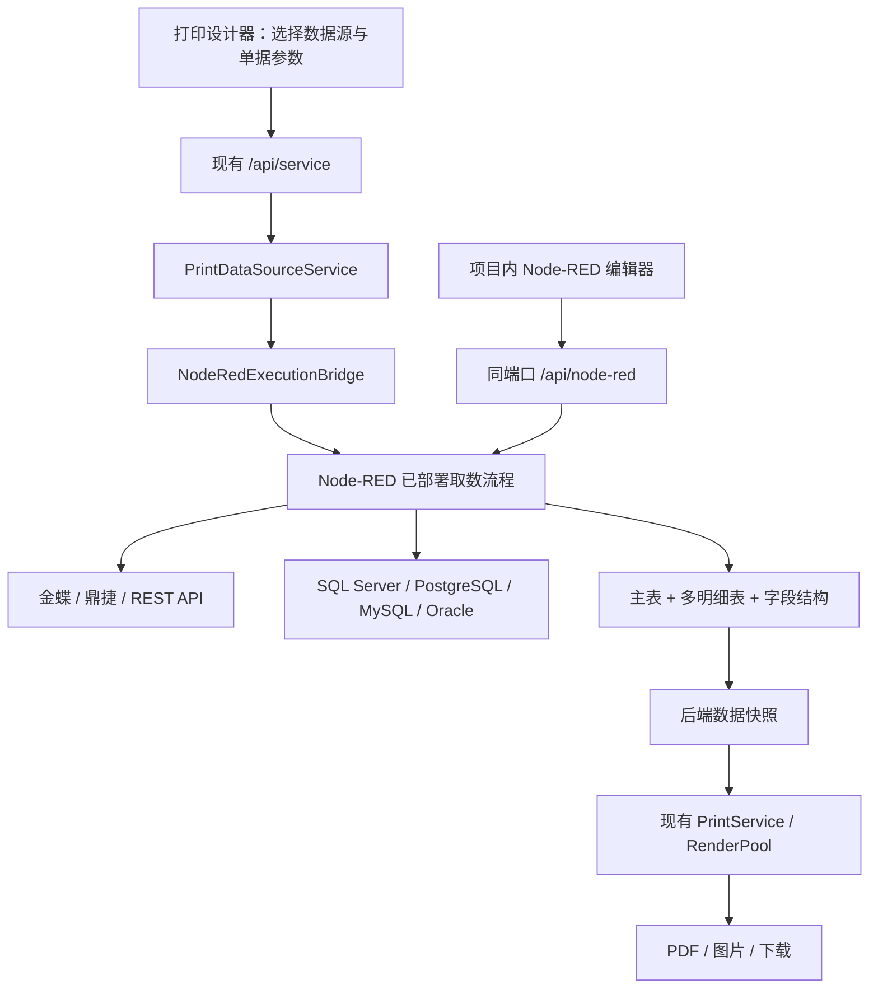

# Node-RED 内嵌打印数据源编排方案

更新日期：2026-10-08。状态：修订设计，尚未安装依赖或修改运行代码。

## 1. 定位与范围

将 Node-RED 的完整编辑器与运行时嵌入现有 NestJS/Express 服务，用于自定义后端打印数据源：连接金蝶、鼎捷等 ERP API，或者连接外部数据库，执行查询、分页、关联、字段映射和汇总，输出打印所需的单据数据。

本阶段一个 Runtime、一套连接配置、一套已部署流程，不增加多租户、Runtime Worker 池或账号级流程隔离。项目现有打印接口登录和上下文校验继续复用；这些兼容工作不构成新的多租户设计。

Node-RED 负责取数和数据处理，现有 PrintService、PrintRenderPool 负责模板编译、PDF/图片生成、任务查询及下载。外部 ERP 凭据、数据库连接和查询过程保留在后端。

## 2. 当前代码事实与需要补齐的能力

| 当前位置 | 已有能力 | 集成时的变化 |
| --- | --- | --- |
| `api/src/main.ts`、`api/src/standalone.ts` | NestExpressApplication；已有 HTTP Server | 在已有 Server 初始化 Node-RED；不创建额外监听 |
| `api/src/print-service/print.types.ts` | PrintDataInput 只包含 `kind: records` | 增加注册后端数据源引用；解析后仍生成 records 快照 |
| `api/src/print-service/print.service.ts` | readData 校验 records；readInput 后创建打印任务 | 插入后端数据源解析与异步取数阶段 |
| `frontend/composables/usePrintApi.ts` | 前端发送 records | 增加 sourceCode、params、snapshotId 调用能力 |
| `frontend/composables/usePrintDesignerExport.ts` | 前端 resolveRecords；同时生成 SVG/HTML 快照 | 后端数据源先查询并更新设计器绑定数据，再生成预览快照 |
| `packages/tldraw-vue/src/print/dataSource.ts` | inline/json/csv/http Provider；HTTP 由浏览器 fetch | 增加 backend Provider，只调用本项目接口 |
| `packages/tldraw-vue/src/components/VueDataSourcePanel.vue` | 表头字段、明细表、字段绑定 | 增加后端数据源选择、参数输入、试取数、字段结构展示 |
| `api/src/print-service/print-template.compiler.ts` | 简单 `{{path}}` 插值；对象/数组以 JSON 字符串格式化 | 嵌套明细数组不能直接自动变成动态表格；需要扩展模板渲染 |

已有打印架构文档中的 registeredQuery 是设计项，当前运行代码尚未支持，不能当作现成功能使用。当前前端导出与后端编译也不能直接保证“每张单据动态明细分页”。

## 3. 同进程、同端口集成



- `/api/node-red/`：完整编辑器、Admin API、编辑器 Comms WebSocket。
- `/api/service`：数据源列表、试取数、预览、正式打印、任务查询。
- 首期不需要暴露 HTTP In 流程接口，配置 `httpNodeRoot: false`，通过进程内桥接调用取数流程。
- 如后续需要 ERP 回调，再在同一个 Server 挂载 `/api/node-red-http/`，单独增加鉴权。

使用 `RED.init(app.getHttpServer(), settings)`，挂载 `RED.httpAdmin`，由 Nest 唯一调用 `listen()`，再启动 `RED.start()`。设置来自项目代码，嵌入方式不会自动使用 Node-RED 自带 settings.js。`main.ts` 和 `standalone.ts` 复用同一个初始化函数，各自一个应用进程仅初始化一次。

生产路径已有 Caddy `/api/*` 代理；开发环境补齐 Vite WebSocket 代理并验证路径转发。Node-RED Comms 与已有 Socket.IO 共用 Server，但 URL 不同；验收包括聊天连接、编辑器 Debug 和部署同时正常。退出时停止 Runtime、关闭连接池并完成 Nest shutdown。

## 4. npm 与开源选型

以下版本来自 2026-10-08 对 npm registry 的直接查询，表示选型候选，尚未验证与本项目的实际运行兼容性。安装时固定版本并提交 pnpm-lock.yaml。

| 组件 | 版本 | 用途与建议 |
| --- | --- | --- |
| [node-red](https://www.npmjs.com/package/node-red) | 5.0.8 | 必选；完整 Runtime、Editor API、Editor Client、核心节点；Node >=22.9，当前本机 v22.17.0 满足 |
| [node-red-contrib-mssql-plus](https://www.npmjs.com/package/node-red-contrib-mssql-plus) | 0.13.1 | SQL Server 直连候选；参数化查询/存储过程；按客户数据库选择 |
| [node-red-contrib-postgresql](https://www.npmjs.com/package/node-red-contrib-postgresql) | 0.16.2 | PostgreSQL 直连候选；参数化查询 |
| [node-red-node-mysql](https://www.npmjs.com/package/node-red-node-mysql) | 3.0.4 | 官方额外节点仓库提供的 MySQL 节点 |
| [oracledb](https://www.npmjs.com/package/oracledb) | 7.0.1 | Oracle 官方驱动；封装项目节点；thin/thick 模式按客户版本和环境验证 |

HTTP Request、Change、Switch、Split、Join、Catch、Status 为核心节点，不需要单独安装。`@node-red/runtime`、`@node-red/editor-api`、`@node-red/editor-client` 由 node-red 主包提供，不手工拼装，不直接作为 Vue 组件导入。`@types/node-red` 当前为 1.3.5，不能假设完整覆盖 5.x；TypeScript 适配层采用经验证的窄接口声明。

开源参考：

- [Node-RED 主仓库](https://github.com/node-red/node-red)：正式嵌入与自定义节点基础，Apache-2.0。
- [Node-RED 额外节点](https://github.com/node-red/node-red-nodes)：官方数据库连接节点与实现参考，具体包许可逐个检查。
- [MSSQL Plus](https://github.com/bestlong/node-red-contrib-mssql-plus)：SQL Server 节点候选。
- [PostgreSQL 节点](https://github.com/alexandrainst/node-red-contrib-postgresql)：PostgreSQL 节点候选。
- [Oracle Node.js 驱动](https://github.com/oracle/node-oracledb)：Oracle 驱动基础。

首期不用 Dashboard、uibuilder 或 FlowFuse 平台；已有 Vue 设计器负责业务界面，Node-RED 自带 Editor 负责流程编辑。

如果“代码集成”进一步要求上游源码进入本仓库，可固定 Node-RED tag/commit，放在独立 vendor 目录并维护构建补丁。默认采用 npm 完整包：编辑器代码和运行时代码随本项目构建部署，同进程运行，已经满足无独立 Node-RED 服务/端口的要求。源码 vendoring 仅在确需改动编辑器内部时采用，并保留 LICENSE/NOTICE。

## 5. ERP 与数据库连接方式

### 5.1 ERP API：按产品适配

不定义一个通用“金蝶节点”覆盖所有产品。连接配置至少包含 vendor、product、version、baseUrl、credentialRef 和认证策略。

- 金蝶需区分 K/3 Cloud/星空、苍穹、星辰等产品的实际接口与授权方式。
- 鼎捷需确认 T100、TIPTOP、易飞等具体产品、版本、已开放接口和授权。
- ERP Adapter 负责认证、token/session 缓存、刷新、错误归一化、分页、必要的接口签名。
- Node-RED 流程负责调用哪些业务查询、查询顺序、关联与字段映射。

先使用核心 HTTP Request + 子流程做可验证样例；稳定后封装 `erp-query` 和连接配置节点。没有给出具体 ERP 版本和接口文档前，不承诺统一接口路径、字段或现成第三方 npm 节点可以直接用。

官方入口：[金蝶开放平台](https://open.kingdee.com/)、[金蝶开发者社区](https://developer.kingdee.com/)、[鼎捷官网](https://www.digiwin.com/)。这些是确认客户产品资料的入口，不代表已验证具体客户接口。

### 5.2 数据库直连：只读取数

连接配置保存数据库类型、地址、库名、驱动选项和 credentialRef。采用只读账号、客户提供的视图或查询存储过程。SQL 使用驱动支持的绑定参数；表名、字段名等不能用普通值参数绑定的标识符采用固定查询或受控白名单。

打印参数只接收单号、单据 ID、日期等业务值；调用方不能提交连接串、密码、任意 URL 或 SQL。节点配置人员可以编辑取数逻辑，打印使用者只选择已发布数据源。只读账号是实际保护边界，不能依赖检查 SQL 是否以 SELECT 开头。

客户 ERP 内网必须能从项目后端访问：部署在客户内网，或配置 VPN/已有网络通道；不增加 Node-RED 端口不会自动解决网络可达性。

### 5.3 示例流程

```text
print-source-in
  → 校验 billNo / documentIds
  → erp-query 查询单据主表
  → erp-query 或 db-query 查询明细
  → 按单据 ID 关联客户、物料和明细
  → 字段映射、金额处理、排序、汇总
  → print-source-out
```

可并行查询互不依赖的数据。Split/Join 汇合必须按本次执行 ID 区分，不能把不同打印请求的结果混合。只重试已确认幂等的取数调用；金额、精度、日期时区明确转换规则。

## 6. 进程内执行桥：真正的后端调用

Node-RED 不是直接调用任意 flow JSON 后返回 Promise 的查询库，需要项目提供执行适配层。

注册表将 sourceCode 映射到已部署的 `print-source-in` 节点，打印调用方只能提交 sourceCode 和 params。NodeRedExecutionBridge 为每次执行创建唯一 executionId、超时、取消控制和结果等待项，向入口节点注入消息；出口节点校验结果并完成等待项。

建议新增自定义节点包 `packages/node-red-print-nodes/`，采用 Node-RED 标准节点模块声明，包含后端节点代码与编辑器 HTML 配置，通过项目构建安装。

| 节点 | 职责 |
| --- | --- |
| print-source-in | 数据源 code、入参结构、试取数上限、执行上下文 |
| erp-connection / db-connection | 连接引用和认证配置；凭据留在后端 |
| erp-query / db-query | 受控 ERP 操作或参数化数据库查询 |
| print-source-out | 输出 records、schema、primaryKey，完成桥接结果 |
| print-source-error | 把可捕获异常转换成统一失败；连接 Catch 节点 |

运行时节点注入使用固定版本的 Node-RED 节点接口，全部封装在桥接适配器中，并做集成测试，不让 PrintService 依赖内部模块路径。JS 消息克隆可能丢失对象身份；消息只传 executionId，不把 Promise、回调或 AbortSignal 塞入消息。

建议初始默认值：试取数 10 条、15 秒；正式取数 60 秒；每个连接最大 5 个并发。上限可配置，但受现有打印大小限制约束。超时/取消时清理等待项并尝试取消底层查询；不能取消的节点迟到结果被忽略。流程异常未被 Catch 捕获也由总超时兜底。

Node-RED 单进程存在同步 Function 代码阻塞主 API 的风险，流程管理员应受信任；首期不开放任意模块安装和 CPU 密集脚本执行。不要把 Function 节点当作强安全沙箱。

## 7. 打印数据契约与模板绑定

一个 records 元素对应一张业务单据，保持主表对象和明细数组的层次：

```json
{
  "records": [
    {
      "id": "SO-1001",
      "billNo": "SO-1001",
      "customer": { "name": "示例客户" },
      "items": [
        { "materialCode": "A001", "materialName": "物料一", "qty": 2, "amount": "100.00" }
      ],
      "packages": [
        { "packageNo": "PK-01", "weight": "1.25" }
      ],
      "totalAmount": "100.00"
    }
  ],
  "primaryKey": "id"
}
```

另存输出 schema，描述 customer.name、items[].qty 等路径、类型、标签与明细表归属。由 schema 驱动设计器字段列表，不以首条样本推断全部字段。表头绑定 billNo/customer.name；明细表绑定 items；另一明细表绑定 packages；主表数量决定单据数量。

Node-RED 输出保留嵌套数组，不把主表重复展开成多行。明细行数、排序、分页和跨页表头属于打印渲染规则。

现有后端模板编译仅支持简单插值，必须补齐结构化模板到动态表格/分页的编译，才能实现完全由后端按 templateId + params 打印主从单据。仅新增 records 取数模式不能解决动态明细渲染。

## 8. 项目服务接口与快照

继续使用统一服务入口。可先将新增方法放入现有 print 服务，避免为了首期数据源再扩展公共 serviceName。

```json
{
  "serviceName": "print",
  "serviceMethod": "testDataSource",
  "postData": {
    "sourceCode": "kingdee.sales-order",
    "params": { "billNo": "SO-1001" }
  }
}
```

建议方法：listDataSources、testDataSource、resolveDataSource、getDataSourceRun。试取数返回有限样本和 schema；resolveDataSource 保存后端快照，返回 snapshotId、sourceCode、deployedRevision、recordCount 和少量预览数据。

正式打印的拟新增输入：

```json
{
  "serviceName": "print",
  "serviceMethod": "createExportJob",
  "postData": {
    "template": { "templateId": "tpl-sales-order", "version": 12 },
    "data": {
      "kind": "registeredSource",
      "sourceCode": "kingdee.sales-order",
      "params": { "billNo": "SO-1001" }
    },
    "output": {
      "format": "pdf",
      "page": { "widthMm": 210, "heightMm": 297 }
    }
  }
}
```

该接口形状是拟新增设计，当前代码不支持 registeredSource。已有 records 模式保留。为保证所见即所得，可直接以 `data: { kind: 'snapshot', snapshotId: '...' }` 打印预览所用的数据快照；重印也复用快照，不自动重新查询 ERP。

异步导出先创建 queued 任务，再执行取数，记录阶段 `resolving-data → compiling-template → rendering`，随后保存 records 快照并进入 RenderPool。现有预览 15 秒等待从 readInput 之后才开始计时，应调整为覆盖取数与渲染的总预算，慢 ERP 查询返回异步状态。打印 Worker 接收不可变数据，不接收 ERP 凭据，也不执行 ERP 查询。

当前 records 验证限制为：最多 5000 条主记录、单条 1 MB、总共 5 MB。主记录中的明细数组同样计入体积。先沿用这些限制；超限返回明确错误，后续再引入文件型快照与分批处理，不能声称当前已有大批量流式打印。

## 9. 编辑器、发布与存储

Vue 中新增“后端数据源”管理页面，并同源嵌入 `/api/node-red/` 完整编辑器。打印设计器只显示数据源选择、参数和字段绑定；管理员通过“编辑取数流程”进入 Node-RED。复用项目登录，为编辑器提供可续期的访问会话，管理员才可部署流程；不能仅靠前端隐藏入口保护 Admin API 或 WebSocket。

连接凭据使用 Node-RED credentials 或项目集中凭据仓储，不进入普通 flow JSON、前端、Debug 输出和执行日志。配置稳定的 credentialSecret；不能使用代码中固定默认密钥。生产关闭在线节点安装、外部模块自动安装与 Function 动态依赖。对打印取数节点不提供数据库写入能力。

单实例首期允许使用稳定 userDir + 本地 flows/credentials 存储，配持久化卷和备份。数据库自定义 storageModule 不再是首期前置条件。

项目数据库管理：

- print_data_sources：sourceCode、入口节点 ID、参数 schema、输出 schema、启用状态。
- print_data_source_snapshots：输出 records 或文件引用、数据哈希、来源与过期时间。
- print_data_source_runs：取数状态、耗时、连接引用、错误、关联打印 jobId。
- node_red_deployments：完整部署快照、修订号、操作者、时间；凭据独立保存。

Node-RED Admin API 的 `/flows` 部署以 Runtime 流程集合为单位。单 Runtime 首期只支持一套当前已部署修订；模板记录本次实际使用的 deployedRevision，不允许传任意旧 revision 并假装可同时执行。编辑器未部署的修改不影响已部署流程；保存数据库草稿、部署前校验和回滚是项目扩展能力。

正式部署前暂停新取数并排空在途请求，检查唯一 sourceCode、入口/出口、连接、schema 和必需节点，再部署并更新注册索引与审计。试取数调用当前已部署流程；如需未发布草稿独立运行，未来增加隔离测试执行环境，本阶段不承诺。

## 10. 实施顺序与验收

1. 嵌入 node-red，验证同端口编辑器、Comms、原有 Socket.IO 和应用启停；完成进程内 in/out/error 桥。
2. 接入一个真实 ERP 产品或一个只读数据库，完成主表、多明细表、分页和字段映射样例。
3. 注册后端数据源，设计器选择 sourceCode、配置参数、试取数、展示 schema；更新前端 backend Provider。
4. 先完成“后端取数 + 设计器样本预览/导出”；样本加载后重新生成快照，验证没有旧明细残留。
5. 扩展结构化模板编译和动态明细分页，完成 templateId + params 的纯后端打印、快照重印与异步取数。
6. 验证并发请求关联、错误和超时、取消清理、ERP token 刷新、查询参数绑定、部署时在途请求处理、凭据不泄露。

关键验收：一张主表关联两张明细；两单据同时查询不会串数据；ERP 数据变化后重印旧快照保持一致；未登录不能部署流程；同源入口可用，系统无新增 Node-RED 监听端口。

后续接入真实客户时需要提供 ERP 产品/版本、接口文档或只读数据库结构、一份真实脱敏单据及对应打印模板。方案设计可先实施；具体连接适配只能以这些资料验证。

## 官方技术依据

- [嵌入已有应用](https://nodered.org/docs/user-guide/runtime/embedding)
- [Node-RED 编辑器与自定义 token 认证](https://nodered.org/docs/user-guide/runtime/securing-node-red)
- [自定义节点](https://nodered.org/docs/creating-nodes/)
- [5.0.8 Runtime 节点接口源码](https://github.com/node-red/node-red/blob/5.0.8/packages/node_modules/%40node-red/runtime/lib/nodes/index.js)
- [5.0.8 Comms WebSocket 源码](https://github.com/node-red/node-red/blob/5.0.8/packages/node_modules/%40node-red/editor-api/lib/editor/comms.js)
