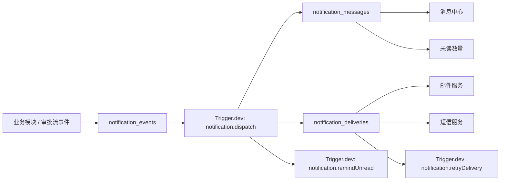

# 消息通知系统 Trigger.dev 驱动设计方案

## 1. 目标

建设一套统一的消息通知系统，覆盖系统提醒、审批通知、@提醒、邮件、短信、站内信、未读数量和消息中心。

本方案基于当前系统架构：

- 前端：`frontend`，Nuxt 3，后台菜单由 `admin_routes` 动态驱动，业务页面可通过低代码页面渲染。
- 主业务后端：`api`，NestJS，统一服务入口为 `/api/service`。
- 审批后端：`services/workflow-api`，NestJS，审批流执行由 Trigger.dev 驱动。
- 数据层：Supabase/PostgreSQL，权限体系由 `admin_permissions`、`admin_routes`、`lowcode_pages` 和 RLS 共同承担。

核心原则：

- PostgreSQL 是消息中心、未读数和投递记录的真源。
- Trigger.dev 是通知调度、异步投递、延迟提醒、失败重试和摘要任务的执行引擎。
- 前端只查询统一通知模型，不直接拼接审批待办、抄送、系统公告等多个来源。
- 所有通知写入必须具备幂等键，避免 Trigger.dev 重试或工作流恢复导致重复消息。

## 2. 总体架构



职责边界：

| 模块 | 职责 |
|---|---|
| `api/src/notification` | 消息查询、未读数、已读状态、系统通知创建、用户偏好、管理接口 |
| `services/workflow-api` | 在审批任务、抄送、转交、加签、通过、驳回等节点产生通知事件 |
| Trigger.dev | 消费事件，创建消息，投递邮件/短信，延迟提醒，失败重试，摘要发送 |
| PostgreSQL | 保存事件、站内信、投递记录、模板、用户偏好和审计数据 |
| `frontend` | 消息中心页面、顶部铃铛、未读角标、最近消息弹层 |

## 3. 核心数据模型

### 3.1 `notification_events`

保存业务原始事件。事件只表达“发生了什么”，不直接等同于用户消息。

建议字段：

| 字段 | 类型 | 说明 |
|---|---|---|
| `id` | uuid | 主键 |
| `tenant_id` | text | 租户，默认 `default` |
| `event_type` | text | 事件类型，如 `approval.task.created`、`mention.created` |
| `source_type` | text | 来源类型，如 `workflow_task`、`workflow_instance`、`system_notice` |
| `source_id` | text | 来源 ID |
| `actor_id` | uuid | 触发人 |
| `payload` | jsonb | 事件数据 |
| `idempotency_key` | text | 幂等键，唯一 |
| `status` | text | `pending`、`processing`、`processed`、`failed` |
| `created_at` | timestamptz | 创建时间 |
| `processed_at` | timestamptz | 处理完成时间 |

关键索引：

- `unique (tenant_id, idempotency_key)`
- `(tenant_id, status, created_at desc)`
- `(tenant_id, event_type, created_at desc)`

### 3.2 `notification_messages`

站内信和消息中心的主表。未读数量也基于此表统计。

建议字段：

| 字段 | 类型 | 说明 |
|---|---|---|
| `id` | uuid | 主键 |
| `tenant_id` | text | 租户 |
| `event_id` | uuid | 关联 `notification_events` |
| `recipient_id` | uuid | 接收用户 |
| `category` | text | `system`、`approval`、`mention`、`security`、`business` |
| `channel` | text | 固定为 `inbox`，表示站内信 |
| `title` | text | 标题 |
| `content` | text | 正文摘要 |
| `link_url` | text | 跳转链接 |
| `priority` | text | `low`、`normal`、`high`、`urgent` |
| `source_type` | text | 来源类型 |
| `source_id` | text | 来源 ID |
| `metadata` | jsonb | 扩展数据 |
| `read_at` | timestamptz | 已读时间 |
| `archived_at` | timestamptz | 归档时间 |
| `created_at` | timestamptz | 创建时间 |

关键索引：

- `(tenant_id, recipient_id, read_at, created_at desc)`
- `(tenant_id, recipient_id, category, created_at desc)`
- `unique (tenant_id, recipient_id, source_type, source_id, category)`，用于避免重复站内信

### 3.3 `notification_deliveries`

外部渠道投递记录。邮件、短信、未来的企业微信等都记录在这里。

建议字段：

| 字段 | 类型 | 说明 |
|---|---|---|
| `id` | uuid | 主键 |
| `tenant_id` | text | 租户 |
| `event_id` | uuid | 关联事件 |
| `message_id` | uuid | 可选，关联站内信 |
| `recipient_id` | uuid | 接收用户 |
| `channel` | text | `email`、`sms` |
| `target` | text | 邮箱或手机号 |
| `template_code` | text | 模板编码 |
| `status` | text | `pending`、`sending`、`sent`、`failed`、`canceled` |
| `attempt_count` | integer | 尝试次数 |
| `provider_message_id` | text | 第三方消息 ID |
| `error_message` | text | 失败原因 |
| `next_retry_at` | timestamptz | 下次重试时间 |
| `sent_at` | timestamptz | 发送成功时间 |
| `created_at` | timestamptz | 创建时间 |

关键索引：

- `(tenant_id, status, next_retry_at)`
- `(tenant_id, recipient_id, created_at desc)`
- `unique (tenant_id, channel, event_id, recipient_id)`

### 3.4 `notification_templates`

通知模板表。

建议字段：

| 字段 | 类型 | 说明 |
|---|---|---|
| `code` | text | 模板编码 |
| `name` | text | 模板名称 |
| `event_type` | text | 适用事件 |
| `channel` | text | `inbox`、`email`、`sms` |
| `title_template` | text | 标题模板 |
| `content_template` | text | 内容模板 |
| `status` | text | `active`、`inactive` |
| `metadata` | jsonb | 扩展配置 |

### 3.5 `notification_preferences`

用户通知偏好。

建议字段：

| 字段 | 类型 | 说明 |
|---|---|---|
| `tenant_id` | text | 租户 |
| `user_id` | uuid | 用户 |
| `category` | text | 通知分类 |
| `inbox_enabled` | boolean | 是否站内信 |
| `email_enabled` | boolean | 是否邮件 |
| `sms_enabled` | boolean | 是否短信 |
| `quiet_hours` | jsonb | 免打扰时间 |

## 4. Trigger.dev 任务设计

### 4.1 `notification.dispatch`

即时通知分发任务。

输入：

```ts
type NotificationDispatchPayload = {
  eventId: string;
  tenantId: string;
  idempotencyKey: string;
};
```

职责：

- 读取 `notification_events`。
- 根据事件类型解析接收人。
- 根据用户偏好创建 `notification_messages`。
- 根据用户偏好创建 `notification_deliveries`。
- 调用邮件/短信供应商。
- 更新事件状态。
- 对未读二次提醒场景创建 `notification.remindUnread` 延迟任务。

幂等要求：

- 同一个 `eventId` 多次执行，最多创建一批相同的 `notification_messages`。
- 同一个 `eventId + recipientId + channel` 只能创建一条投递记录。
- 发送外部渠道前先锁定 delivery 状态为 `sending`。

### 4.2 `notification.remindUnread`

未读二次提醒任务。

输入：

```ts
type NotificationRemindUnreadPayload = {
  messageId: string;
  tenantId: string;
  delayMinutes: number;
};
```

职责：

- 延迟指定时间后读取 `notification_messages`。
- 如果消息仍未读，生成二次提醒事件或外部渠道投递。
- 如果消息已读或已归档，任务直接结束。

适用场景：

- 审批待办 30 分钟未读，发送邮件。
- 紧急审批 10 分钟未读，发送短信。
- 系统安全提醒未读，发送二次站内提醒。

### 4.3 `notification.retryDelivery`

失败投递重试任务。

职责：

- 扫描 `notification_deliveries` 中 `status = failed` 且 `next_retry_at <= now()` 的记录。
- 按退避策略重试。
- 超过最大次数后保持 `failed`，供运维页面处理。

### 4.4 `notification.digest`

摘要任务。

职责：

- 按用户和分类聚合未读消息。
- 发送每日或每周邮件摘要。
- 摘要不改变原始消息未读状态。

### 4.5 `notification.cleanup`

清理任务。

职责：

- 归档过期已读消息。
- 清理过期投递临时数据。
- 保留审计需要的数据，不硬删除关键业务事件。

## 5. 通知事件类型

第一期建议支持：

| 事件类型 | 分类 | 说明 |
|---|---|---|
| `system.notice.created` | `system` | 系统提醒 |
| `approval.task.created` | `approval` | 审批待办创建 |
| `approval.task.transferred` | `approval` | 审批转交 |
| `approval.task.add_signed` | `approval` | 审批加签 |
| `approval.task.completed` | `approval` | 审批通过 |
| `approval.task.rejected` | `approval` | 审批驳回 |
| `approval.cc.created` | `approval` | 审批抄送 |
| `mention.created` | `mention` | @提醒 |

推荐幂等键：

```text
system-notice:{noticeId}:{recipientId}
approval-task:{taskId}:created:{recipientId}
approval-task:{taskId}:transferred:{recipientId}
approval-task:{taskId}:add-signed:{recipientId}
approval-task:{taskId}:completed:{recipientId}
approval-task:{taskId}:rejected:{recipientId}
approval-cc:{ccId}:created:{recipientId}
mention:{sourceType}:{sourceId}:{recipientId}
```

## 6. API 设计

新增 `api/src/notification` 模块，并接入 `ServiceGatewayController`。

建议服务方法：

| serviceMethod | 说明 |
|---|---|
| `listMessages` | 查询当前用户消息 |
| `getUnreadCount` | 查询当前用户未读数量 |
| `markRead` | 标记单条或多条消息已读 |
| `markAllRead` | 按分类或全部标记已读 |
| `archiveMessage` | 归档消息 |
| `createSystemNotice` | 创建系统通知，管理员权限 |
| `listDeliveries` | 查询投递记录，管理员权限 |
| `retryDelivery` | 手动重试投递，管理员权限 |
| `listTemplates` | 模板列表，管理员权限 |
| `saveTemplate` | 保存模板，管理员权限 |
| `getPreferences` | 当前用户通知偏好 |
| `savePreferences` | 保存当前用户通知偏好 |

示例调用：

```ts
await serviceApi.invoke('notification', 'getUnreadCount');

await serviceApi.invoke('notification', 'listMessages', {
  category: 'approval',
  unreadOnly: true,
  page: 1,
  pageSize: 20
});

await serviceApi.invoke('notification', 'markRead', {
  ids: ['message-id']
});
```

## 7. 前端设计

### 7.1 消息中心

优先使用低代码页面上线：

- 路由：`/dashboard/messages`
- 页面：`notification-message-center`
- 数据源：`notification.listMessages`
- 操作：标记已读、全部已读、按分类筛选、跳转来源页面

分类建议：

- 全部
- 系统提醒
- 审批通知
- @提醒
- 未读

### 7.2 顶部铃铛

在 `frontend/layouts/dashboard.vue` 增加原生组件：

- 展示未读角标。
- 点击打开最近消息弹层。
- 支持跳转消息中心。
- 支持单条标记已读。
- 第一阶段使用轮询，后续升级实时推送。

建议封装：

```text
frontend/composables/useNotificationApi.ts
frontend/components/NotificationBell.vue
```

### 7.3 实时策略

第一期：

- 登录后拉取未读数量。
- 每 30 到 60 秒轮询一次。
- 标记已读后本地立即更新角标。

后续：

- 使用 Supabase Realtime 或 SSE 推送当前用户未读数变化。

## 8. 审批流集成设计

当前审批流已有：

- `wf_task`：审批待办。
- `wf_cc`：审批抄送，并已有 `read_at`。
- `wf_history_event`：审批历史事件。
- Trigger.dev `workflow.instance.run`：审批流程执行入口。

建议集成点：

| 场景 | 触发位置 | 通知事件 |
|---|---|---|
| 创建审批任务 | `createTasks` 后 | `approval.task.created` |
| 创建抄送 | `createCcItems` 后 | `approval.cc.created` |
| 转交任务 | `transferTask` 成功后 | `approval.task.transferred` |
| 加签任务 | `addSignTask` 成功后 | `approval.task.add_signed` |
| 审批通过 | `prepareTaskDecision` approve 成功后 | `approval.task.completed` |
| 审批驳回 | `prepareTaskDecision` reject 成功后 | `approval.task.rejected` |

集成方式建议：

- `workflow-api` 不直接写复杂通知逻辑。
- 新增轻量 `NotificationIntegrationService` 或调用主业务 API 的内部接口。
- 只写 `notification_events` 并触发 `notification.dispatch`。
- 事件 payload 中保存 `taskId`、`instanceId`、`title`、`operatorId`、`recipientIds`、`linkUrl`。

## 9. 权限与安全

RLS 和服务权限建议：

- 普通用户只能读取自己的 `notification_messages`。
- 普通用户只能修改自己的 `read_at`、`archived_at`。
- 管理员可管理系统通知、模板和投递记录。
- Trigger.dev worker 使用服务角色或数据库连接写入投递状态。
- 外部渠道目标地址不在普通列表中展示完整值，必要时脱敏。

新增权限建议：

| 权限编码 | 说明 |
|---|---|
| `notification.messages.read` | 读取个人消息 |
| `notification.messages.manage` | 管理消息中心数据 |
| `notification.notices.manage` | 创建系统通知 |
| `notification.templates.manage` | 管理通知模板 |
| `notification.deliveries.manage` | 管理投递记录 |

## 10. 分阶段实施计划

### 阶段 0：架构冻结与接口契约

目标：

- 明确通知系统边界、表结构、事件类型、Trigger.dev task 和 API 契约。

实施步骤：

- [ ] 确认通知系统归属主业务后端 `api`。
- [ ] 确认 Trigger.dev 只做调度和投递，PostgreSQL 作为消息真源。
- [ ] 确认第一期渠道为站内信，邮件/短信只预留表结构和 delivery 状态。
- [ ] 明确第一批事件类型和幂等键规则。
- [ ] 明确审批流和通知系统之间的集成方式。

测试验证：

- 设计评审覆盖系统提醒、审批通知、@提醒、站内信、未读数和消息中心。
- 事件幂等键能覆盖所有第一期通知场景。
- API 契约能支持消息中心和顶部铃铛。

完成指标：

- 本文档评审通过。
- 第一批表、API、任务名称和事件类型不再频繁变更。

### 阶段 1：数据库迁移与权限

目标：

- 建立通知系统数据真源。

实施步骤：

- [ ] 新增 Supabase migration：`notification_events`。
- [ ] 新增 Supabase migration：`notification_messages`。
- [ ] 新增 Supabase migration：`notification_deliveries`。
- [ ] 新增 Supabase migration：`notification_templates`。
- [ ] 新增 Supabase migration：`notification_preferences`。
- [ ] 添加索引、唯一约束和 RLS 策略。
- [ ] seed 通知相关权限到 `admin_permissions`。
- [ ] 将通知权限绑定到 `system_admin`。

测试验证：

- 执行迁移后所有表可创建。
- 普通用户只能查询自己的消息。
- 普通用户不能查询其他用户投递记录。
- 管理员可查询模板和投递记录。
- 唯一幂等约束能阻止重复事件或重复消息。

完成指标：

- 迁移可重复执行。
- 核心查询使用索引，`explain` 不出现明显全表扫描风险。
- RLS 策略符合个人消息隔离要求。

### 阶段 2：主业务后端 NotificationModule

目标：

- 在 `api` 中提供消息中心和未读数 API。

实施步骤：

- [ ] 新增 `api/src/notification/notification.module.ts`。
- [ ] 新增 `NotificationService` 实现 `ServiceExecutor`。
- [ ] 接入 `ServiceRouterService` 和 `ServiceGatewayController` serviceName 校验。
- [ ] 实现 `listMessages`。
- [ ] 实现 `getUnreadCount`。
- [ ] 实现 `markRead`。
- [ ] 实现 `markAllRead`。
- [ ] 实现 `archiveMessage`。
- [ ] 实现 `createSystemNotice` 管理接口。
- [ ] 实现基础模板和偏好接口。

测试验证：

- 当前用户能分页查询自己的消息。
- 未读数量与 `read_at is null` 记录一致。
- 标记已读后未读数量减少。
- 标记全部已读后未读数量为 0。
- 非管理员调用系统通知创建接口返回权限错误。

完成指标：

- `pnpm --dir api typecheck` 通过。
- 至少覆盖消息列表、未读数、标记已读、权限拒绝四类单元或集成测试。
- Nuxt 通过 `/api/service` 可正常调用 `notification` 服务。

### 阶段 3：Trigger.dev 通知任务

目标：

- 建立异步分发和投递执行链路。

实施步骤：

- [ ] 在 `services/workflow-api/src/trigger` 或共享任务目录新增 `notification.dispatch`。
- [ ] 实现读取 `notification_events`。
- [ ] 实现基于模板生成站内信。
- [ ] 实现创建 `notification_deliveries`。
- [ ] 实现 delivery 状态机：`pending -> sending -> sent/failed`。
- [ ] 实现 `notification.retryDelivery`。
- [ ] 实现 `notification.remindUnread` 的基础逻辑。
- [ ] 添加幂等保护和事务边界。

测试验证：

- 同一个 event 重复触发 dispatch 不产生重复消息。
- dispatch 失败后再次执行可恢复。
- delivery 失败后能进入 `failed` 并生成 `next_retry_at`。
- retry 到最大次数后停止重试。
- 未读提醒任务在消息已读时不发送二次提醒。

完成指标：

- `pnpm --dir services/workflow-api typecheck` 通过。
- Trigger.dev 本地 `trigger:dev` 可识别通知任务。
- 至少完成一个站内信 dispatch 的端到端测试。

### 阶段 4：审批流通知集成

目标：

- 审批待办、抄送、转交、加签、通过、驳回可以自动产生通知。

实施步骤：

- [ ] 在创建 `wf_task` 后写入 `approval.task.created` 事件。
- [ ] 在创建 `wf_cc` 后写入 `approval.cc.created` 事件。
- [ ] 在 `transferTask` 成功后写入 `approval.task.transferred` 事件。
- [ ] 在 `addSignTask` 成功后写入 `approval.task.add_signed` 事件。
- [ ] 在审批通过后写入 `approval.task.completed` 事件。
- [ ] 在审批驳回后写入 `approval.task.rejected` 事件。
- [ ] 每个事件写入后触发 `notification.dispatch`。
- [ ] 为审批通知生成可跳转链接。

测试验证：

- 发起审批后审批人收到站内信。
- 抄送节点执行后接收人收到站内信。
- 转交后新处理人收到站内信，原处理人不再收到重复待办提醒。
- 加签后加签人收到站内信。
- 审批通过和驳回后相关人员收到结果通知。
- Trigger.dev 重试不会重复发同一条审批通知。

完成指标：

- 一条完整审批流程能产生预期通知记录。
- 消息中心可查看审批通知并跳转到对应任务或流程。
- 审批流原有测试不回退。

### 阶段 5：前端消息中心与顶部未读角标

目标：

- 用户能在后台查看通知、处理未读、看到顶部未读数量。

实施步骤：

- [ ] 新增 `notification-message-center` 低代码页面 seed。
- [ ] 新增 `/dashboard/messages` 动态路由菜单。
- [ ] 新增 `useNotificationApi.ts`。
- [ ] 新增 `NotificationBell.vue`。
- [ ] 在 `frontend/layouts/dashboard.vue` 接入铃铛。
- [ ] 未读数量初期使用轮询。
- [ ] 支持从消息跳转到来源页面。

测试验证：

- 登录后顶部展示正确未读数量。
- 标记单条已读后角标即时减少。
- 标记全部已读后角标清零。
- 消息中心分类筛选正确。
- 无消息、加载中、接口错误状态展示正常。
- 菜单权限控制符合 `admin_routes` 和 `admin_permissions`。

完成指标：

- `pnpm --dir frontend typecheck` 通过。
- 桌面端主要视口下消息中心可用。
- 顶部铃铛不影响现有菜单、退出和用户信息操作。

### 阶段 6：邮件和短信渠道

目标：

- 在站内信基础上补齐邮件和短信投递。

实施步骤：

- [ ] 选型邮件供应商。
- [ ] 选型短信供应商。
- [ ] 配置环境变量和 provider adapter。
- [ ] 实现邮件模板渲染。
- [ ] 实现短信模板渲染。
- [ ] 接入 `notification_deliveries` 状态机。
- [ ] 接入失败重试。
- [ ] 支持用户偏好控制邮件和短信。

测试验证：

- 邮件目标为空时不创建 email delivery。
- 手机号为空时不创建 sms delivery。
- 邮件发送成功后状态为 `sent`。
- 供应商失败后状态为 `failed` 并记录错误。
- 用户关闭邮件偏好后不发送邮件。
- 紧急审批可按规则发送短信。

完成指标：

- 至少一个邮件供应商和一个短信供应商接入完成。
- 投递记录可查询、可重试、可审计。
- 外部渠道故障不影响站内信创建。

### 阶段 7：实时推送、运维与生产加固

目标：

- 提升通知系统实时性、可观测性和生产可维护性。

实施步骤：

- [ ] 评估 Supabase Realtime、SSE 或 WebSocket。
- [ ] 未读数量变更时推送给当前用户。
- [ ] 新增投递失败管理页面。
- [ ] 新增模板管理页面。
- [ ] 新增通知发送量、失败率、重试次数、未读积压等指标。
- [ ] 新增消息归档和清理策略。
- [ ] 对高频事件增加限流和合并策略。

测试验证：

- 新消息写入后前端角标能实时更新。
- 网络断开重连后未读数量可重新同步。
- 投递失败可人工重试。
- 大量消息下分页查询稳定。
- 摘要任务不会重复发送同一周期摘要。

完成指标：

- 未读角标延迟满足产品目标。
- 投递失败可定位、可重试、可统计。
- 消息中心在大数据量下查询稳定。

## 11. 全链路验收场景

### 场景 1：系统提醒

步骤：

1. 管理员创建系统提醒。
2. 系统写入 `notification_events`。
3. Trigger.dev 执行 `notification.dispatch`。
4. 接收人消息中心出现站内信。
5. 顶部未读数量增加。
6. 用户标记已读。

验收指标：

- 接收人只收到一条消息。
- 未读数加 1 后再减 1。
- 非接收人不可见。

### 场景 2：审批待办通知

步骤：

1. 用户发起审批。
2. `workflow.instance.run` 创建 `wf_task`。
3. 系统写入 `approval.task.created`。
4. Trigger.dev 创建审批站内信。
5. 审批人从消息中心跳转审批任务。

验收指标：

- 审批人收到待办通知。
- 非审批人不收到待办通知。
- 重试不重复创建消息。

### 场景 3：@提醒

步骤：

1. 用户在评论或业务表单中 @ 另一个用户。
2. 系统写入 `mention.created`。
3. Trigger.dev 分发通知。
4. 被 @ 用户收到站内信，必要时收到邮件。

验收指标：

- 被 @ 用户收到通知。
- 发起人不会因为自己 @ 自己产生异常。
- 同一 source 下重复提交不会重复通知。

### 场景 4：邮件/短信失败重试

步骤：

1. 创建一个需要邮件或短信投递的通知。
2. 模拟供应商失败。
3. delivery 状态变为 `failed`。
4. `notification.retryDelivery` 到期后重试。
5. 重试成功后状态变为 `sent`。

验收指标：

- 失败原因可查询。
- 重试次数正确增加。
- 超过最大次数后不再自动重试。

## 12. 推荐优先级

第一批必须完成：

1. 数据库真源和 RLS。
2. `NotificationModule` 的消息列表、未读数、已读接口。
3. `notification.dispatch` 站内信分发。
4. 审批待办和抄送通知集成。
5. 消息中心页面。
6. 顶部未读角标。

第二批完成：

1. 转交、加签、审批结果通知。
2. 用户通知偏好。
3. 邮件投递。
4. 失败重试。

第三批完成：

1. 短信投递。
2. 未读二次提醒。
3. 摘要任务。
4. 实时推送。
5. 运维管理页面。

## 13. 风险与控制

| 风险 | 控制措施 |
|---|---|
| Trigger.dev 重试导致重复消息 | 所有事件、消息、投递记录使用幂等键和唯一约束 |
| 未读数不准 | 未读数只从 `notification_messages.read_at is null` 统计 |
| 外部渠道失败影响站内信 | 站内信创建和外部投递分离，外部失败只影响 delivery |
| 审批通知与审批任务状态不一致 | 审批任务仍以 `wf_task` 为准，通知只是提醒 |
| 高频事件造成消息噪音 | 对低优先级事件做合并、摘要和用户偏好控制 |
| 权限越权 | RLS 限制个人消息，管理接口使用 `admin_permissions` |
| 模板渲染注入 | 模板只支持受控变量替换，不执行任意 JS |

## 14. 最小 MVP 范围

MVP 建议只做：

- `notification_events`
- `notification_messages`
- `notification_deliveries` 基础表
- `notification.dispatch` 站内信分发
- `notification.listMessages`
- `notification.getUnreadCount`
- `notification.markRead`
- `notification.markAllRead`
- 审批待办通知
- 审批抄送通知
- 消息中心页面
- 顶部未读角标

MVP 暂不做：

- 真正短信发送
- 复杂摘要
- 实时推送
- 模板可视化编辑
- 多供应商路由

MVP 完成标准：

- 用户能收到审批和系统站内信。
- 用户能看到未读数量。
- 用户能在消息中心查看、筛选、标记已读。
- Trigger.dev 重试不会重复创建通知。
- 通知系统故障不阻塞审批主流程。

## 15. 工程落地文件清单

### 15.1 数据库与种子数据

建议新增：

```text
supabase/migrations/20260728xxxx_notification_system.sql
```

包含内容：

- `notification_events`
- `notification_messages`
- `notification_deliveries`
- `notification_templates`
- `notification_preferences`
- 通知权限 seed
- 消息中心低代码页面 seed
- 消息中心菜单 route seed
- RLS policy
- 索引和唯一约束

建议权限 seed：

```text
notification.messages.read
notification.messages.manage
notification.notices.manage
notification.templates.manage
notification.deliveries.manage
```

建议菜单：

```text
/dashboard/messages
```

建议低代码页面：

```text
notification-message-center
```

### 15.2 主业务后端 `api`

建议新增：

```text
api/src/notification/notification.module.ts
api/src/notification/notification.service.ts
api/src/notification/notification.types.ts
```

需要修改：

```text
api/src/app.module.ts
api/src/gateway/service-router.service.ts
api/src/gateway/service-gateway.controller.ts
api/src/common/dto/service-invoke.dto.ts
```

第一期最小方法：

```text
listMessages
getUnreadCount
markRead
markAllRead
createSystemNotice
```

第二期方法：

```text
archiveMessage
listDeliveries
retryDelivery
listTemplates
saveTemplate
getPreferences
savePreferences
```

### 15.3 Trigger.dev 通知任务

当前 Trigger.dev 任务集中在：

```text
services/workflow-api/src/trigger
```

建议新增：

```text
services/workflow-api/src/trigger/notification.task.ts
services/workflow-api/src/notification/notification-dispatcher.ts
services/workflow-api/src/notification/notification-renderer.ts
services/workflow-api/src/notification/notification-delivery.ts
```

如果后续通知模块变大，可以再拆为独立服务：

```text
services/notification-api
```

第一期不建议拆独立服务，避免同时增加太多部署面。

### 15.4 审批流集成

优先修改：

```text
services/workflow-api/src/runtime/runtime.postgres-store.ts
services/workflow-api/src/runtime/workflow.executor.ts
services/workflow-api/src/runtime/runtime.engine.types.ts
```

建议新增集成服务：

```text
services/workflow-api/src/integration/notification.integration.ts
```

集成原则：

- 审批主流程只负责写通知事件。
- 通知事件写入失败不能悄悄吞掉，必须记录 `wf_history_event` 或服务日志。
- 是否阻断审批主流程需要按事件级别配置：待办通知失败默认不阻断审批创建，数据一致性由补偿任务处理。

### 15.5 Nuxt 前端

建议新增：

```text
frontend/composables/useNotificationApi.ts
frontend/components/NotificationBell.vue
```

需要修改：

```text
frontend/layouts/dashboard.vue
```

低代码消息中心通过数据库 seed 注入，前端不需要新增专门页面文件。

如果低代码列表能力不足，再新增原生页面：

```text
frontend/pages/dashboard/messages.vue
```

第一期优先走低代码页面，保持和当前后台模块风格一致。

## 16. 建议测试命令

### 16.1 类型检查

```bash
pnpm --dir api typecheck
pnpm --dir services/workflow-api typecheck
pnpm --dir frontend typecheck
```

### 16.2 审批流现有测试

```bash
pnpm --dir services/workflow-api test
```

### 16.3 数据库迁移验证

如果使用 Supabase 本地环境：

```bash
supabase db reset
```

如果使用项目现有脚本或 SQL 控制台：

```bash
psql "$DATABASE_URL" -f supabase/migrations/20260728xxxx_notification_system.sql
```

验证点：

- 重复执行 migration 不报错。
- 通知表存在。
- 权限 seed 存在。
- `system_admin` 拥有通知管理权限。
- 普通用户无法读取他人消息。

### 16.4 API Smoke Test

建议准备一个脚本：

```text
api/scripts/smoke-notification.ts
```

覆盖：

- 创建系统通知。
- 当前用户查询消息列表。
- 查询未读数量。
- 标记已读。
- 重复创建同一幂等键通知。

完成后可输出：

```text
artifacts/notification-smoke-results.json
```

### 16.5 Trigger.dev 本地验证

```bash
pnpm --dir services/workflow-api trigger:dev
```

验证点：

- `notification.dispatch` 可被识别。
- 输入同一个 `eventId` 执行两次不重复创建消息。
- 模拟 delivery 失败后生成重试状态。

### 16.6 前端人工验收

启动：

```bash
pnpm dev
pnpm api:dev
pnpm workflow-api:dev
```

验收页面：

```text
/dashboard/messages
```

验收点：

- 菜单可见。
- 消息列表可加载。
- 未读筛选可用。
- 标记已读后未读角标更新。
- 点击审批通知可跳转来源。

## 17. MVP 开发顺序

建议按下面顺序开发，避免前端等待后端或通知任务与数据表互相卡住。

### 17.1 第一步：通知表和权限

产出：

- migration
- RLS
- 权限 seed
- 消息中心 route seed

完成后先不用 Trigger.dev，直接手动插入测试消息，验证消息中心查询基础成立。

### 17.2 第二步：`NotificationModule` 查询闭环

产出：

- `listMessages`
- `getUnreadCount`
- `markRead`
- `markAllRead`

完成后前端已经可以做消息中心和顶部角标。

### 17.3 第三步：站内信 dispatch

产出：

- `notification.dispatch`
- 事件到站内信的幂等创建逻辑
- 基础模板渲染

完成后可以通过插入 `notification_events` 测试自动生成消息。

### 17.4 第四步：系统提醒

产出：

- `createSystemNotice`
- 系统提醒事件写入
- 触发 `notification.dispatch`

这是最简单的业务入口，适合作为通知系统第一条端到端链路。

### 17.5 第五步：审批待办和抄送通知

产出：

- `approval.task.created`
- `approval.cc.created`
- 审批消息跳转链接

完成后通知系统具备核心业务价值。

### 17.6 第六步：顶部铃铛

产出：

- `useNotificationApi`
- `NotificationBell`
- dashboard layout 接入

此时用户已经能在日常后台操作中看到未读提醒。

### 17.7 第七步：审批操作通知

产出：

- 转交通知
- 加签通知
- 通过通知
- 驳回通知

此阶段补齐审批流通知体验。

### 17.8 第八步：邮件投递和失败重试

产出：

- email delivery
- provider adapter
- retry task
- delivery 管理查询

短信建议放在邮件稳定后再接。

## 18. 第一版验收清单

第一版上线前至少满足：

- [ ] 数据库迁移可重复执行。
- [ ] 普通用户只能读取自己的消息。
- [ ] 管理员可以创建系统提醒。
- [ ] 系统提醒能生成站内信。
- [ ] 审批待办能生成站内信。
- [ ] 审批抄送能生成站内信。
- [ ] 未读数量准确。
- [ ] 标记已读后未读数量准确减少。
- [ ] Trigger.dev 重试不会重复创建消息。
- [ ] 通知失败不阻塞审批主流程。
- [ ] 消息中心菜单可见并可进入。
- [ ] 顶部铃铛能显示未读角标。
- [ ] `api`、`workflow-api`、`frontend` 类型检查通过。
- [ ] 现有审批流测试通过。

## 19. 当前开发完成记录

更新时间：2026-07-27

已完成阶段：

- 阶段 1：数据库迁移与权限，已落地 `notification_events`、`notification_messages`、`notification_deliveries`、`notification_templates`、`notification_preferences`，并补充审批动作、邮件/短信、未读提醒、摘要模板。
- 阶段 2：主业务后端 `NotificationModule`，已支持消息列表、未读数量、标记已读、全部已读、归档、系统提醒、个人偏好、投递记录查询和手动重试标记。
- 阶段 3：Trigger.dev 通知任务，已支持 `notification.dispatch`、`notification.retryDelivery`、`notification.remindUnread`、`notification.digest`、`notification.cleanup`。
- 阶段 4：审批流通知集成，已支持待办、抄送、转交、加签、通过、驳回事件，并通过 `notification.dispatch` 幂等分发。
- 阶段 5：前端消息中心与顶部未读角标，已支持列表、筛选、未读统计、单条/批量/全部已读、单条/批量归档、通知偏好开关和顶部铃铛。
- 阶段 6：邮件和短信渠道，已支持基于用户偏好的 delivery 创建、provider webhook adapter、本地模拟 provider、发送状态、失败退避和手动重试。
- 阶段 7：运维入口，已新增投递记录页面 `/dashboard/notification-deliveries`，支持状态/渠道筛选和失败投递重试标记。

当前验证：

- `pnpm --dir services/workflow-api typecheck` 通过。
- `pnpm --dir api typecheck` 通过。
- `pnpm --dir frontend typecheck` 通过。
- `pnpm --dir services/workflow-api exec tsx src/runtime/runtime.service.spec.ts` 通过。

剩余生产增强：

- 接真实邮件/短信供应商时配置 `NOTIFICATION_EMAIL_WEBHOOK_URL`、`NOTIFICATION_SMS_WEBHOOK_URL` 和可选 `NOTIFICATION_PROVIDER_TOKEN`。
- 如需实时推送，可在前端引入 Supabase Realtime 或服务端 SSE；当前第一版仍使用轮询。
- 投递记录页面已经接入，后续可按生产需要继续增加 provider 日志详情、批量重试和告警统计。
