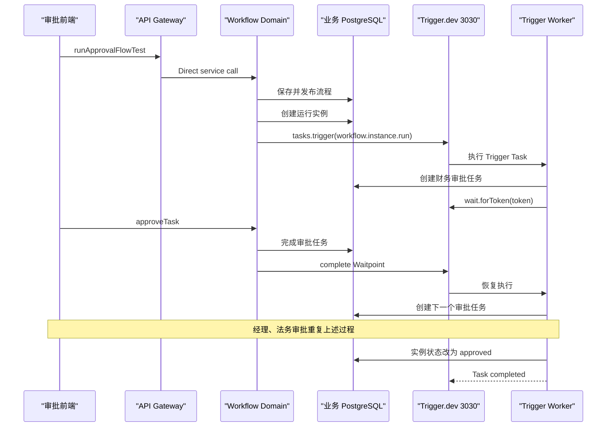

```mermaid
sequenceDiagram
    participant UI as "审批前端"
    participant API as "API Gateway"
    participant WF as "Workflow Domain"
    participant DB as "业务 PostgreSQL"
    participant TD as "Trigger.dev 3030"
    participant Worker as "Trigger Worker"

    UI->>API: runApprovalFlowTest
    API->>WF: Direct service call
    WF->>DB: 保存并发布流程
    WF->>DB: 创建运行实例
    WF->>TD: tasks.trigger(workflow.instance.run)
    TD->>Worker: 执行 Trigger Task
    Worker->>DB: 创建财务审批任务
    Worker->>TD: wait.forToken(token)

    UI->>WF: approveTask
    WF->>DB: 完成审批任务
    WF->>TD: complete Waitpoint
    TD->>Worker: 恢复执行
    Worker->>DB: 创建下一个审批任务

    Note over UI,Worker: 经理、法务审批重复上述过程

    Worker->>DB: 实例状态改为 approved
    Worker-->>TD: Task completed
```
